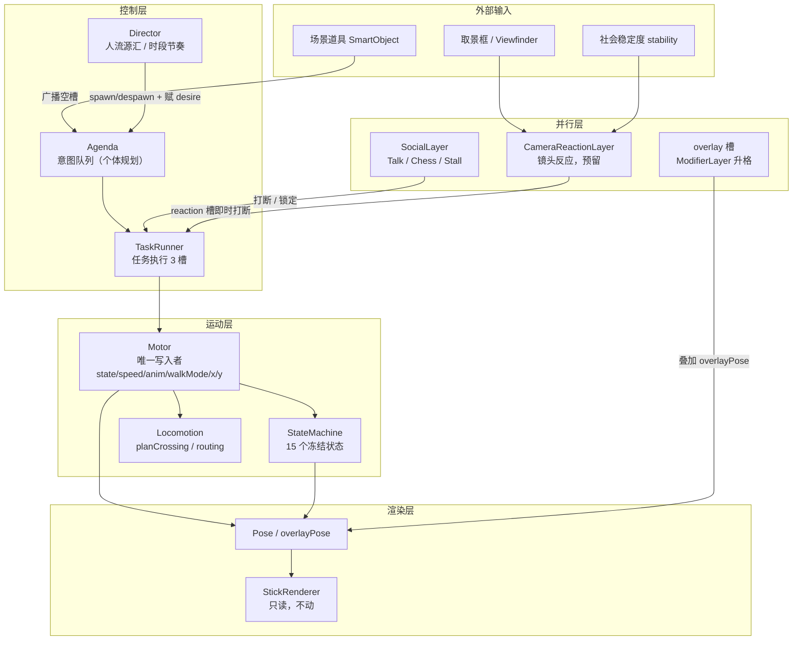
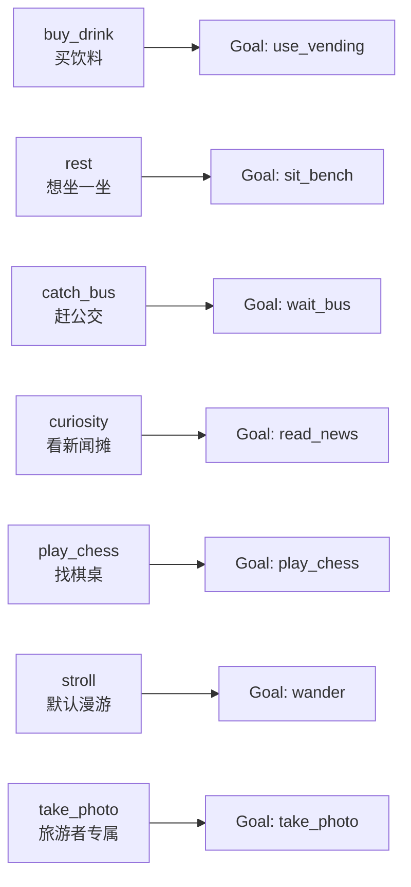
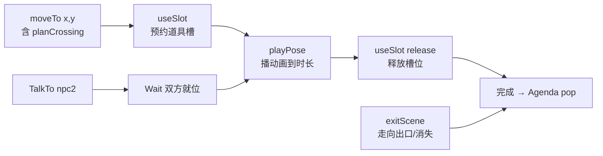
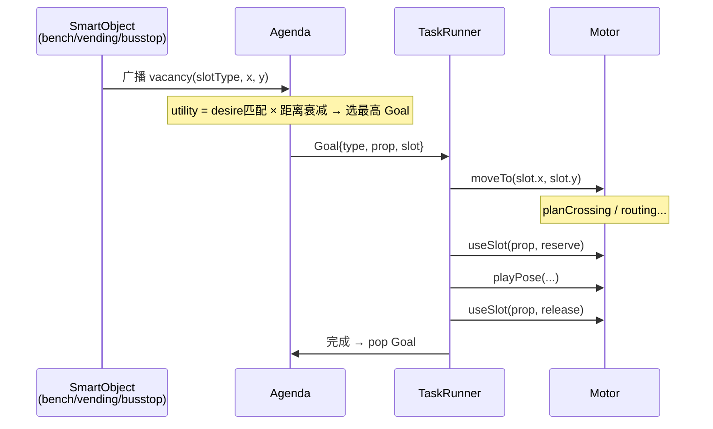

> **SNAPSHOT** — 2026-07-11. 准确内容已迁入 `docs/contracts/behavior.md`；本文件保留作历史参考，不再维护。

# NPC 行为系统：分层架构设计蓝图

> 本文档描述**目标架构**，不是现有代码的状态说明。
> 当前实现见 `js/behavior/`；现有状态机规格见 [npc-states.md](./npc-states.md)。

---

## 1.1 分层架构图



---

## 1.2 各层职责与铁律

### Director（人流源汇 / 时段节奏）

Director 负责**人流的生成与消亡节奏**，不参与个体决策。

- **源**：建筑门（居民/商务出行）、公交到站下客、画面左右边缘入场
- **汇**：进楼（目的地建筑门）、上公交（等车后到站消失）、出画（步行离开边缘）
- **时段密度曲线**：早高峰商务人士多、午后游客与老人多、夜间稀疏
- **入场时赋 desire**：按源类型 + profile 权重为每个 NPC 掷 0~2 个初始 desire（见 1.3 节）；exit 方向在入场时确定
- **铁律**：Director 只做 spawn/despawn 调度，个体的目标选择与行为规划全部由 Agenda 负责

### Agenda（意图队列 / 个体规划）

- 持有该 NPC 的 **desire 列表**（spawn 时赋值，不随时间变化）
- 接收 SmartObject 广播的空槽，结合 desire 匹配度 + 距离衰减计算 utility，选出最高目标生成 Goal
- 有序队列，最多 3 条意图（Goal），每个 Goal 包含：目标类型 + 参数 + 优先级 + TTL
- **铁律**：Agenda 不执行任何动作，只存储意图；所有执行由 TaskRunner 完成

### TaskRunner（任务执行，3 个固定槽）

| 槽 | 用途 | 说明 |
|---|---|---|
| `primary` | 主行为（走路 / 坐 / 下棋） | 同一时间只有一个 |
| `overlay` | 叠加行为（看手机 / 抽烟） | 现 ModifierLayer 升格，可与 primary 并行 |
| `reaction` | 镜头反应 | 最高优先级，CameraReactionLayer 直接写入，即时打断 primary，不经 Agenda |

- TaskRunner 从 Agenda 取出 Goal，分解为 Task Primitives（1.4 节）并向 Motor 发命令
- Task 完成 / 失败后通知 Agenda 弹出，选下一 Goal
- **铁律**：同一帧内只有 TaskRunner 发 Motor 命令；overlay 槽低频随机触发，不走 Agenda

### Motor（唯一写入者）

Motor 是 `npc.state` / `npc.speed` / `npc.animation` / `npc._walkMode` / `npc.x` / `npc.y` 的**唯一合法写入者**。TaskRunner 只发命令（`moveTo` / `useSlot` / `faceTo` / `playPose` / `exitScene`），Motor 解释命令后写入字段并驱动 StateMachine。`setState` 降为 Motor 内部函数，外部不再直接调用。

- 执行碰撞检测（EnvironmentQuery.pointBlocked）、区域边界夹紧
- 驱动 Locomotion（`planCrossing` / routing）
- **铁律**：迁移期在 debug 模式用 `Object.defineProperty` 断言，非 Motor 写上述字段即报错
- **铁律**：深度缩放只读 `depthT(y)`，不允许出现第二套深度公式

### StateMachine（15 个冻结状态）

- 状态集合：`walk run jog stand loiter sit_bench lie_bench sit_ground lie_ground squat lean_wall routing fall chess chess_onlooker`
- 由 Motor 内部调用切换，不对外暴露
- 进入新状态时设置 `npc.animation` / `npc.speed` / `npc.stateDur`
- **铁律**：不在此列表的状态名永远不会出现；需要新行为先在此列表增加，再实现

### planCrossing（在 Goto primitive 内）

- 所有跨侧路由必须经过 `planCrossing`（WalkMode.js），不许直接 teleport
- 守法行人走最近斑马线（`initCrosswalks` 注册），乱穿按 `profile.jaywalkChance`
- TrafficSignal 接口留 stub（永绿），扩展时替换

### Pose / StickRenderer

- `npc.overlayPose` 只由 overlay 槽（ModifierLayer 升格后）写入
- StickRenderer 是无状态渲染器，**永远不动**

---

## 1.3 Desire 模型

NPC **spawn 时**按 profile 权重掷 **0~2 个 desire**，代表该 NPC 这次出行想完成的事情。Desire 在离场前不随时间变化；utility 由 desire 匹配度 × SmartObject 广播 × 距离衰减三项相乘得出。



**Desire 掷骰规则**：

- `stroll` 是保底 desire（所有 NPC 都有），对应默认漫游行为
- 其余 desire 按 profile 权重抽取，最多额外掷 1~2 个
- Desire 匹配 SmartObject 类型时 utility 乘以 profile 权重系数；无匹配则只靠距离衰减产生极低 utility（偶尔顺路使用）

**长寿命常驻 NPC**（摊主等）可选用运行时 need 接口（need 值随时间累积触发补货/休息等），普通行人不使用。

---

## 1.4 Task Primitives

TaskRunner 向 Motor 发送的原子命令及常用组合。



**组合示例 — UseBench**：

```
moveTo(bench.x, bench.y)
→ useSlot(bench, 'seat')
→ playPose('sit_bench', dur=rand(10,30))
→ useSlot(bench, release)
```

**组合示例 — UseVending**：

```
moveTo(vending.x, vending.y)
→ useSlot(vending, 'user')
→ playPose('stand', dur=rand(5,15))   // overlay 槽叠加 phone_look
→ useSlot(vending, release)
```

---

## 1.5 SmartObject 交互模式



**道具类型与槽位定义**：

| SmartObject | 槽位 | 同时容纳 |
|---|---|---|
| bench | `seat` | 1 人 |
| vending | `user` | 1 人 |
| chess_table | `player_a`, `player_b`, `onlooker×N` | 2+N 人 |
| bus_stop | `waiter×N` | N 人（到站批量上车） |
| news_rack | `reader` | 1 人 |
| stall | `seller`(常驻), `buyer×N` | 1+N 人 |

---

## 1.6 三步迁移方案

每步独立可玩、可回滚。

### Step 1 — Motor 隔离 + 写保护（无感知变化）

- 新建 `js/behavior/Motor.js`：封装对 `npc.x/y/state/speed/animation/_walkMode` 的全部写入
- BaseStateMachine / routing 分支改为向 Motor 发 `moveTo` / `playPose` 命令；现有行为逻辑包装成 primary task 交由 TaskRunner 驱动
- Debug 模式加 `Object.defineProperty` 断言：非 Motor 写上述字段即报错
- **验收**：游戏行为无变化，无报错

### Step 2 — Desire / Utility / Agenda 替换 RouteSelector

- 新建 `js/behavior/Agenda.js`、`js/behavior/TaskRunner.js`
- NPC spawn 时赋 desire；SmartObject 广播空槽后由 Agenda 计算 utility 并生成 Goal
- 现有 `_walkMode` / `_walkModeStack` 的 push/pop 改为 Agenda.push / TaskRunner.run
- `RouteSelector.pickAndStart` 替换为 `stroll` desire → Agenda 产生 `wander` Goal → TaskRunner 的 `moveTo`
- **验收**：过马路、routing、SmartObject 使用、出场行为无变化

### Step 3 — Director 源汇替换 SpawnManager

- 新建 `js/behavior/Director.js`
- 建筑门出行、公交到站下客、边缘入场改由 Director 的源节点驱动，按时段密度曲线控制流量
- SpawnManager 及其随机 spawn 逻辑废弃
- overlay 槽接管 ModifierLayer 的低频随机小动作（看手机 / 抽烟 / 手势），保留低频随机触发方式
- **验收**：NPC 总量稳定，时段分布符合预期；ambient 小动作频率主观感受不变

---

## 1.7 待废弃清单

迁移完成后可删除的模块 / 字段：

| 待废弃 | 替代方案 |
|---|---|
| `RouteSelector` | Agenda 的 `stroll` desire → `wander` Goal |
| `SpawnManager` | Director 源汇节点（建筑门 + 公交下客 + 边缘） |
| `npc._activity` 锁（字符串/布尔） | TaskRunner primary 槽隐式锁定 |
| 散落的 `pushWalkMode` 调用 | Agenda 插入高优先级 Goal |
| `BehaviorManager` 里的 `smartObjectChance` per-frame dice | Agenda utility 驱动 |
| `npc._walkMode` / `npc._walkModeStack` | Agenda queue + TaskRunner slots |
