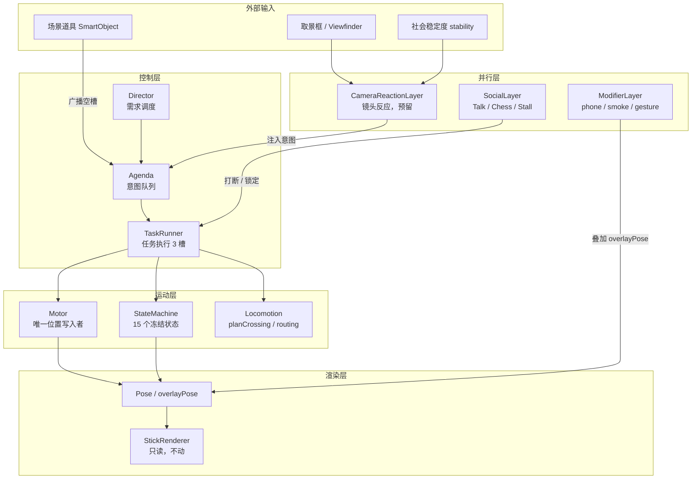
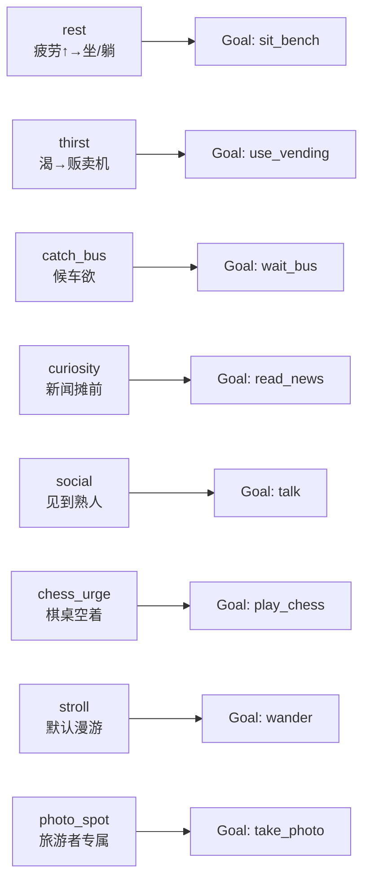
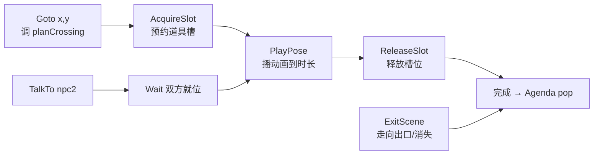
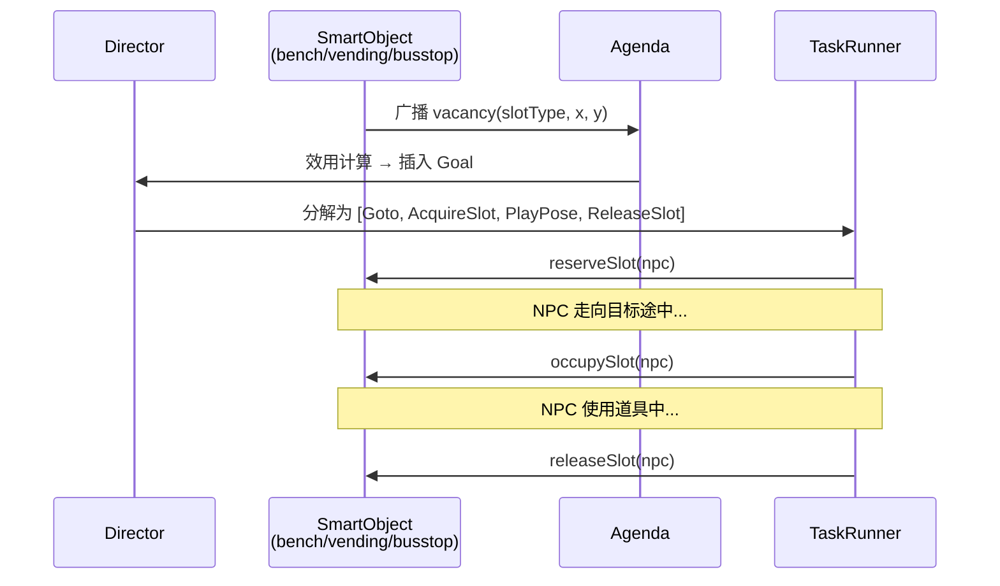

# NPC 行为系统：分层架构设计蓝图

> 本文档描述**目标架构**，不是现有代码的状态说明。
> 当前实现见 `js/behavior/`；现有状态机规格见 [npc-states.md](./npc-states.md)。

---

## 1.1 分层架构图



---

## 1.2 各层职责与铁律

### Director（需求调度）

- 持有 NPC 的**需求向量**（欲望列表，1.3 节定义）
- 每 N 秒 tick 一次需求衰减 / 上升
- 选出效用最高的需求，生成 Goal 推入 Agenda
- **铁律**：Director 只写 Agenda，不直接碰 npc.state / npc.x / npc.y

### Agenda（意图队列）

- 有序队列，最多 3 条意图（Goal）
- 每个 Goal 包含：目标类型 + 参数 + 优先级 + TTL（超时自动丢弃）
- 被 SocialLayer 广播的 SmartObject 可直接向 Agenda 插入意图
- **铁律**：Agenda 不执行任何动作，只存储意图

### TaskRunner（任务执行，3 个固定槽）

| 槽 | 用途 | 说明 |
|---|---|---|
| `primary` | 主行为（走路 / 坐 / 下棋） | 同一时间只有一个 |
| `modifier` | 叠加行为（看手机 / 抽烟） | 可与 primary 并行 |
| `reaction` | 镜头反应 | 最高优先级，可打断 primary |

- TaskRunner 从 Agenda 取出 Goal，分解为 Task Primitives（1.4 节）
- Task 完成 / 失败后通知 Agenda 弹出，选下一 Goal
- **铁律**：同一帧内只有 TaskRunner 写 Motor 指令，所有其他层通过 TaskRunner 间接写位置

### Motor（唯一位置写入者）

- 接收 TaskRunner 的位移指令，写 `npc.x` / `npc.y` / `npc.vx` / `npc.vy`
- 执行碰撞检测（EnvironmentQuery.pointBlocked）、区域边界夹紧
- **铁律**：`npc.x` / `npc.y` 只能由 Motor 写。迁移期用 `Object.defineProperty` 在 debug 模式下捕捉非法写入
- **铁律**：深度缩放只读 `depthT(y)`，不允许出现第二套深度公式

### StateMachine（15 个冻结状态）

- 状态集合：`walk run jog stand loiter sit_bench lie_bench sit_ground lie_ground squat lean_wall routing fall chess chess_onlooker`
- 状态只由 `setState(npc, state, reason)` 切换，reason 用于调试日志
- 进入新状态时设置 `npc.animation` / `npc.speed` / `npc.stateDur`
- **铁律**：不在此列表的状态名永远不会出现；需要新行为先在此列表增加，再实现

### planCrossing（在 Goto primitive 内）

- 所有跨侧路由必须经过 `planCrossing`（WalkMode.js），不许直接 teleport
- 守法行人走最近斑马线（`initCrosswalks` 注册），乱穿按 `profile.jaywalkChance`
- TrafficSignal 接口留 stub（永绿），扩展时替换

### Pose / StickRenderer

- `npc.overlayPose` 只由 ModifierLayer / CameraReactionLayer 写
- StickRenderer 是无状态渲染器，**永远不动**

---

## 1.3 需求 / 目标草图



**需求参数**（每个 profile 独立配置）：

| 字段 | 含义 |
|---|---|
| `initial` | 初始值 [0, 1] |
| `decayRate` | 每秒衰减量（自然消退） |
| `weight` | 效用函数权重 |
| `condition` | 触发 Goal 的阈值 |

---

## 1.4 Task Primitives



**组合示例 — UseBench**：

```
Goto(bench.x, bench.y)
→ AcquireSlot(bench, 'seat')
→ PlayPose('sit_bench', dur=rand(10,30))
→ ReleaseSlot(bench)
```

**组合示例 — UseVending**：

```
Goto(vending.x, vending.y)
→ AcquireSlot(vending, 'user')
→ PlayPose('stand', dur=rand(5,15))   // 叠加 phone_look overlay
→ ReleaseSlot(vending)
```

---

## 1.5 SmartObject 交互模式



**道具类型与槽位定义**：

| SmartObject | 槽位 | 同时容纳 |
|---|---|---|
| bench | `seat` | 1 人 |
| vending | `user` | 1 人 |
| chess_table | `player_a`, `player_b`, `onlooker×N` | 2+N 人 |
| bus_stop | `waiter×N` | N 人（到站批量上车） |
| news_rack | `reader` | 1 人 |
| stall | `seller`(常驻), `buyer×N` | 1+N 人 |

**Need→Utility→Interaction→Slot 流程**：

```
need.thirst += dt * 0.02
if need.thirst > 0.6 → Goal{type:'use_vending', utility: need.thirst * profile.weight.thirst}
Agenda 选效用最高 Goal
TaskRunner: Goto(vending) → AcquireSlot → PlayPose → ReleaseSlot
need.thirst = 0.1   // 满足后重置
```

---

## 1.6 三步迁移方案

每步独立可玩、可回滚。

### Step 1 — Motor 隔离（无感知变化）

- 新建 `js/behavior/Motor.js`：封装 `npc.x += vx * dt` 等位置写入
- BaseStateMachine / routing 分支改为调用 `Motor.move(npc, vx, vy, dt)`
- Debug 模式加 `Object.defineProperty` 断言：非 Motor 写 `npc.x/y` 报错
- **验收**：游戏行为无变化，无报错

### Step 2 — Agenda + TaskRunner 替换 WalkMode 栈

- 新建 `js/behavior/Agenda.js`、`js/behavior/TaskRunner.js`
- 现有 `_walkMode` / `_walkModeStack` 的 push/pop 改为 Agenda.push / TaskRunner.run
- RouteSelector / SpawnManager 路由入口改为生成 Goto task
- planCrossing 内部仍用 modeDirect，但外部调用改为 TaskRunner
- **验收**：过马路、routing、出场行为无变化

### Step 3 — Director + Need 系统替换 per-frame dice

- 新建 `js/behavior/Director.js`、`js/behavior/NeedVector.js`
- 移除 BehaviorManager 里的 `smartObjectChance` per-frame 抽签
- 移除 ModifierLayer 里的 `_tryTriggerHeld` / `_tryTriggerGesture` per-frame 抽签
- 改为 Director tick 需求 → 生成 Goal → TaskRunner 执行
- **验收**：NPC 行为频率主观感受一致，标签生成覆盖率不下降

---

## 1.7 待废弃清单

迁移完成后可删除的模块 / 字段：

| 待废弃 | 替代方案 |
|---|---|
| `RouteSelector` | Director 的 `stroll` 目标生成 Goto |
| `SpawnManager` | Director 的 `ExitScene` task + 入场路由 |
| `npc._activity` 锁（字符串/布尔） | TaskRunner primary slot 隐式锁定 |
| 散落的 `pushWalkMode` 调用 | Agenda 插入高优先级 Goal |
| `BehaviorManager` 里的 `smartObjectChance` per-frame dice | NeedVector 效用驱动 |
| `ModifierLayer._tryTriggerHeld` / `_tryTriggerGesture` per-frame dice | Need.social / Need.boredom 驱动 |
| `npc._walkMode` / `npc._walkModeStack` | Agenda queue + TaskRunner slots |
