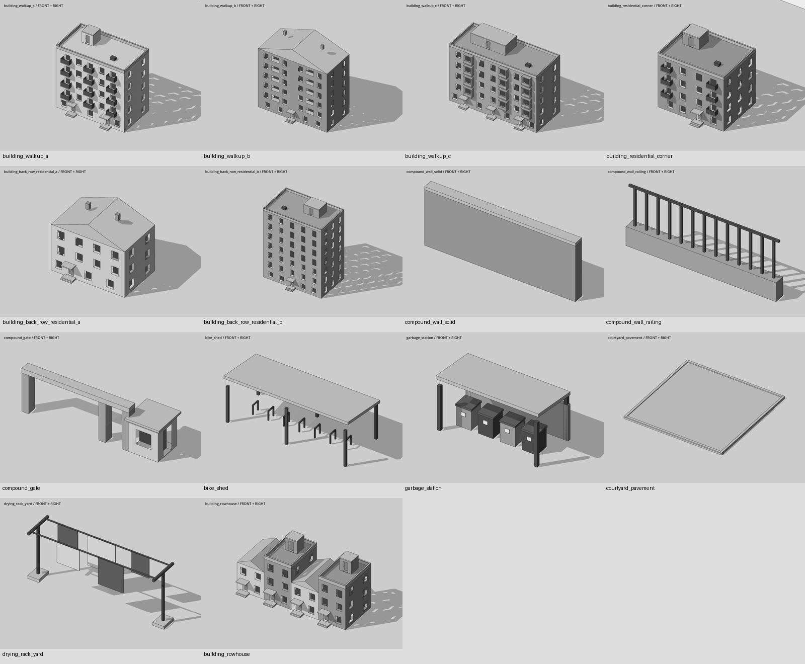
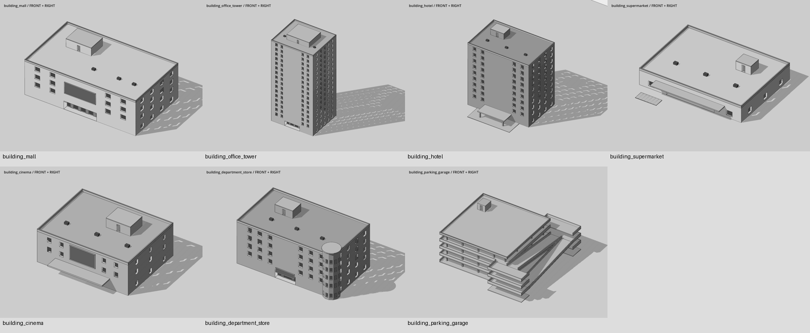

> 2026-09-27 已入库存档：21 件在 `godot/models/`、建模脚本在 `godot/modeling/`（改成输出到 `models/`）、类型在 `godot/types/`，已摆进 `scenes/two_streets/`。下文是 ChatGPT 交货时写的，里面 `delivery/` 的路径和批次工具已不在。

# 第六批：居民区与大型商业建筑（2026-09-26）

已交 21 件：居民区 14 件、大型商业建筑 7 件。`commercial_plaza` 尚未生成：清单同时要求与人行道同高 0.15 米、又用两三级台阶连接，等待 Hsinlung 确认高度。

背面与左侧：[居民区](residential_rear.png)、[商业建筑](commercial_rear.png)。已逐组查看两面预览；每件目录还留有完整分辨率图片。

## 本轮交付

| 名字 | 内容 |
|---|---|
| [building_walkup_a](../models/building_walkup_a/说明.md) | 五层板楼；双单元门、凸阳台、平屋顶楼梯间。 |
| [building_walkup_b](../models/building_walkup_b/说明.md) | 六层砖墙板楼；单单元门、深凹阳台、整栋坡屋顶。 |
| [building_walkup_c](../models/building_walkup_c/说明.md) | 五层石墙板楼；三单元门、封闭阳台、宽幅顶层加建。 |
| [building_residential_corner](../models/building_residential_corner/说明.md) | 四层转角住宅；正面与右侧完整开窗，四面均有凹窗。 |
| [building_back_row_residential_a](../models/building_back_row_residential_a/说明.md) | 三层里侧住宅，四面凹窗、坡顶、偏置入口。 |
| [building_back_row_residential_b](../models/building_back_row_residential_b/说明.md) | 七层里侧住宅，四面窄高凹窗、平顶设备间、中央入口。 |
| [compound_wall_solid](../models/compound_wall_solid/说明.md) | 5 米实墙段，高 2 米，无独立端柱，左右可连排。 |
| [compound_wall_railing](../models/compound_wall_railing/说明.md) | 5 米矮墙加栏杆段，总高 2 米，左右可连排。 |
| [compound_gate](../models/compound_gate/说明.md) | 6 米净车道门洞、1.4 米行人门洞，右侧门卫亭；两个通道均开放。 |
| [bike_shed](../models/bike_shed/说明.md) | 8 米斜顶车棚、七个停车架；前后开放。 |
| [garbage_station](../models/garbage_station/说明.md) | 带顶和后挡墙的垃圾分类站，正面四只桶。 |
| [courtyard_pavement](../models/courtyard_pavement/说明.md) | 10×10 米混凝土地面，顶高 0.15 米，一圈 0.08 米矮路沿。 |
| [drying_rack_yard](../models/drying_rack_yard/说明.md) | 落地双杆双横梁晾衣架，五块有厚度的布。 |
| [building_rowhouse](../models/building_rowhouse/说明.md) | 四户一排，各户独立门与两级台阶；两层、三层及坡顶、平顶交替。 |
| [building_mall](../models/building_mall/说明.md) | 44 米宽四层商场；深门廊、多入口、中央大片实墙与空招牌框。 |
| [building_office_tower](../models/building_office_tower/说明.md) | 17 层写字楼；深门廊、窄竖窗节奏、顶部设备层。 |
| [building_hotel](../models/building_hotel/说明.md) | 十层酒店；伸出 6 米的门廊雨篷、落客平台。 |
| [building_supermarket](../models/building_supermarket/说明.md) | 34 米宽单层超市；一排四个入口、独立购物车存放区。 |
| [building_cinema](../models/building_cinema/说明.md) | 三层影院；中央空海报框、伸出 4 米的大雨篷。 |
| [building_department_store](../models/building_department_store/说明.md) | 五层老式百货楼；对称主立面、右前角圆塔与冠檐。 |
| [building_parking_garage](../models/building_parking_garage/说明.md) | 四层开敞停车楼；楼板、柱网、矮栏板，侧面双列折返车道坡与转弯平台。 |

## 验证与使用

- 每件均包含 GLB、独立构建脚本、说明、完整 `check.txt`、`audit.json` 和两张 Godot 预览。原检查器全部 PASS，无 WARN。
- 脚本使用 Python 3、Shapely 2.1+，输出到脚本旁，已验证重跑 GLB 逐字节一致。尺寸全在各脚本开头的 `D`、`P` 命名参数表；不依赖本目录的辅助脚本。
- 在实际 GLB 上检查封闭实体、正体积和外向绕序。主楼四面有凹窗，主立面窗/门廊开口面积不超过三分之一；最浅主楼门窗凹深 0.48 米。
- 两种围墙端点都在 x=±2.5，可按 5 米中心间距连排。大门净车道 6 米、行人门洞 1.4 米。
- 停车楼四层，层高 3.2 米，坡道水平长 30 米、宽 5 米，坡度约 10.67%；分成相邻两列折返，端头转弯平台深 5.5 米。模型按尺寸衔接，尚未做车辆转弯或驾驶模拟。
- 楼原点在主正面墙脚中点，墙面 z=0、向 −Z 延伸；突出雨篷、台阶等计入包围盒。普通配件原点为完整占地底面中心。门口坐标在各说明和 `audit.json`；门板静态封闭，未制作开关门动画。
- 预览直接读取交货区 GLB，关闭 Godot 导入网格压缩，套用工程现有灰阶、描线和排线；仅独立看模型，没有修改游戏场景、类型库或材质规则。不同模型的截图单独取景，不能凭缩略图比较尺寸。

整批复查：`python delivery/architecture/audit_architecture.py` → `ARCHITECTURE_OK`；详细结果在 `audit.json`。

独立预览：在仓库根目录运行 Godot，参数 `--path godot --script <本目录绝对路径>/render.gd`，可加 `-- --asset <名字>` 只看一件。`make_sheets.py` 从截图生成总览。`assemble.py` 是批次维护工具，修改其参数后可重发独立脚本；审阅或入库只需每件目录。

尚未验收入库。商业广场待明确：建议顶面 y=0.45 米，用两级各 0.15 米台阶连接 y=0.15 米人行道；若保持顶面 y=0.15 米，则应平接并取消台阶。
