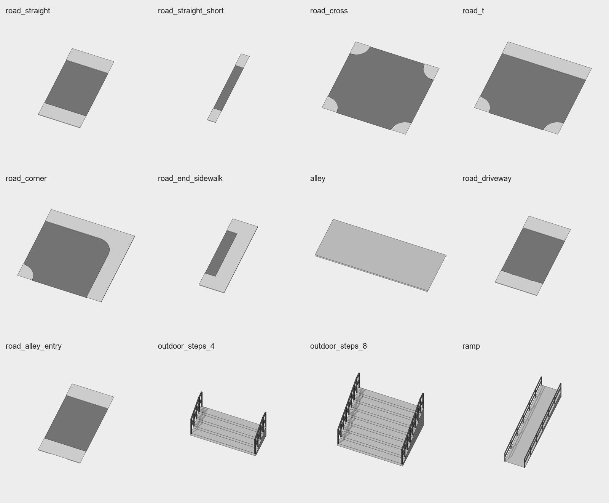
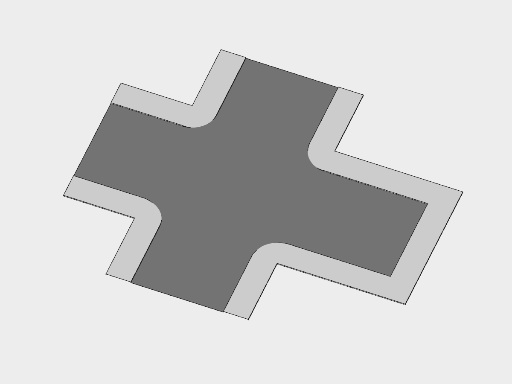
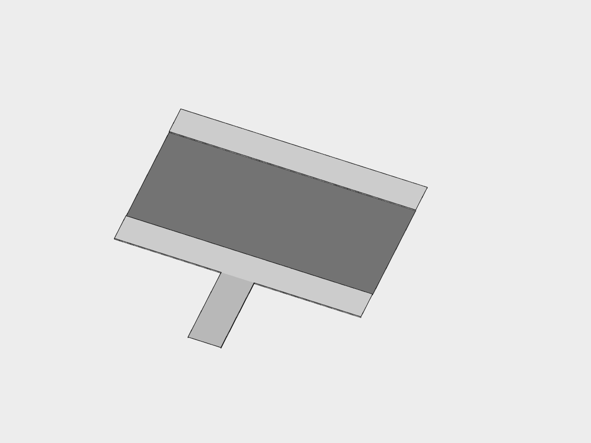
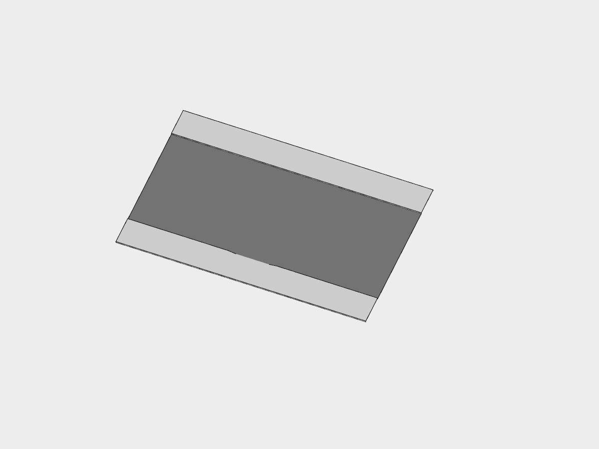

> 2026-09-26 已入库存档：12 件在 `godot/models/`、建模脚本在 `godot/modeling/`、类型在 `godot/types/`。下文是 ChatGPT 交货时写的，里面 `delivery/` 的路径和 `audit_roads.py`、`preview.gd` 已不在；接入要点已做进 `core/level.gd`（合并描线）和各 `.import`（关网格压缩）。

# 第六批道路模块交付（2026-09-26）

12 件模型已交到 `delivery/models/<名字>/`，每件都有 GLB、独立生成脚本、说明、原检查器完整输出和 Godot 截图。附带的 `held_cane` 已在正式库，本轮没有重复制作。



## 验收结果

- 12 件全部 `PASS`，没有改 `check_model.py`。两种台阶和坡道没有 WARN；道路的 WARN 仅为允许的开放边界。
- 全部脚本重跑得到逐字节一致的 GLB，SHA-256 在各件说明和 `audit.json`。
- 街道接口严格为 3.5 + 2 + 9 + 2 + 3.5 米，机动车道和非机动车道 y=0，人行道 y=0.15。接口边的分段也相同，后续合并焊接无需重新三角化。
- 从实际 GLB 检查了顶面完整覆盖、无重叠、无非流形边、无接口封口面、各坡口从 0 连续升至 0.15、台阶尺寸及坡道 1:12。
- Godot 导入后检查：十字加直路/短路/封口 42 条内部接缝边、丁字 21 条、拐弯 14 条、封口 7 条，均恰有两个相邻面，输出 `GODOT_SEAMS_OK`。实际画面中接头没有横线。
- 新模块 Godot 实际拼接：road_driveway 的街道接头 14 条；road_alley_entry 加街道和小巷共 17 条（巷口顶边及两侧边共 3 条），均输出 `GODOT_SEAMS_OK`。
- 已看过全部单件预览、拼接图和坡口近景。尚未接入街道场景或做 NPC 通行验收；这些属于后续入库与场景集成。

## 本轮确认的结构口径

以素材清单 2026-09-26 新增的“无厚度、无底面、拼接端不封口”条款为准，先前讨论的实体底板方案已弃用。道路不加检查器特例。

Hsinlung 确认：**顶面和路沿必须连续；允许拼接端及 y=0 的外侧底边开放，不加底面。** 每件说明分别列出开口边的数量；新增巷口的 4 米连接边界按更新后的清单预留，并另查与小巷拼合后的共边。台阶、扶手和独立坡道仍是实体。

## 模块与默认朝向

| 模型 | 占地 / 通行尺寸 | 有效连接端 |
|---|---|---|
| road_straight | X 长 10，Z 宽 20 | x=±5 |
| road_straight_short | X 长 2，Z 宽 20 | x=±1 |
| road_cross | 20×20，四角半径 3.5 | x=±10、z=±10 |
| road_t | 20×20，−Z 为封闭侧 | x=±10、z=+10 |
| road_corner | 20×20，内外转角半径 3.5 | x=−10、z=+10 |
| road_end_sidewalk | X 长 6，Z 宽 20；尽头铺装深 3.5 | x=−3 |
| alley | X 长 10，Z 宽 4，顶高 0.15 | x=±5 |
| road_driveway | 完整 10×20；+Z 中央 6 米出入口 | x=±5 |
| road_alley_entry | 完整 10×20；+Z 外缘 4 米巷口 | x=±5；巷口 z=10、x=±2 |
| outdoor_steps_4 | 宽 3，踏步深合计 1.2，升高 0.6 | 低端 +Z，上行 −Z |
| outdoor_steps_8 | 宽 3，踏步深合计 2.4，升高 1.2 | 低端 +Z，上行 −Z |
| ramp | 净宽 1.5（本体宽 1.62），水平长 7.2，升高 0.6 | 低端 +Z，上行 −Z |

具体坐标与含扶手包围盒见各件说明。楼梯和坡道的入口/出口平台由场景提供。

## 入库与接入注意

1. **导入时关闭 Godot 的网格压缩**（`meshes/force_disable_compression=true`）。GLB 本身已经无压缩，但 Godot 默认内部压缩仍会把约 4.5 米的端点挪到约 4.4995 米，使描线焊接失败。独立预览使用 `GLTFDocument.IMPORT_FLAG_FORCE_DISABLE_MESH_COMPRESSION`，保留精确坐标。
2. 拼好后先把道路面合到同一个网格，再运行现有描线器；按材质保持不同 surface。**分开对每块模块描线仍会画出开放边。** `preview.gd` 中的 `merge_for_review()` 演示该顺序，仅用于预览，没有修改游戏运行时代码。
3. `road_driveway` 直接替换一块 10 米直路，出入口已做进 +Z 一侧。旧的 `driveway_cut` 已撤下，不再交付。
4. `road_alley_entry` 已预留巷口；把 `alley` 绕 Y 旋转 +90°、中心放到相对道路 (0,0,15)，再合并网格即可。顶面与两侧竖面均已检查共边，无须运行时切面。
5. 没有碰 `street_demo`、类型库、导航和配色；没有加车道标线和斑马线。现有配色把 `road` 和 `bike_lane` 设成同一灰度，所以预览里两者同色，但材质槽与宽度已分别检查。

## 复查

在仓库根目录运行（现有 Python 环境已有 Shapely 2.1.2）：

```powershell
python delivery/roads/audit_roads.py
```

输出 `ROADS_OK`，同时更新每件 `check.txt` 和整批 `audit.json`。每件 `build_<名字>.py` 都是完整脚本，无需旁边有共享辅助文件，输出 GLB 到脚本所在目录。

独立 Godot 截图：

```powershell
& 'D:/Godot/Godot_v4.7.2-stable_win64_console.exe' --path godot --resolution 1200x900 --script "$PWD/delivery/roads/preview.gd" -- --model assembly
```

`--model` 可以换成任何模型名、`cut_close`；查看其他拼接用 `--model assembly_t --junction road_t`、`--model assembly_corner --junction road_corner`、`--model assembly_end --junction road_end_sidewalk`。`--output <绝对路径>` 指定截图位置；`--yaw`、`--pitch` 调整角度，`--top yes` 从正上方看。

## Godot 实拍



[丁字拼接](assembly_t.png) · [转角拼接](assembly_corner.png) · [封口拼接](assembly_end.png) · [路沿坡口近景](cut_close.png)


## 本次返工实拍





复查新拼接：`--model assembly_alley --junction road_alley_entry` 或 `--model assembly_driveway --junction road_driveway`。
