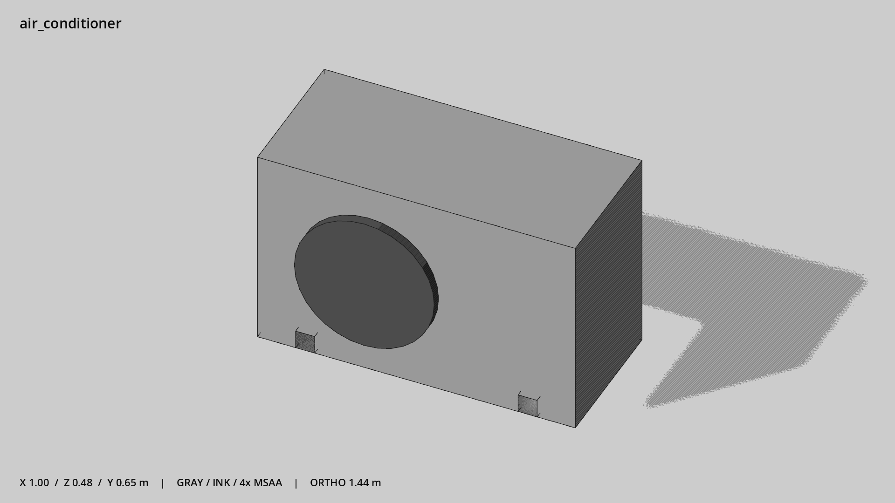

# 空调外机 · `air_conditioner`



- 模型：[GLB](../../../../models/air_conditioner.glb)
- 重建脚本：[build_air_conditioner.py](../../../build_air_conditioner.py)；尺寸在开头 `P` 中。
- 依赖：[model_geometry.py](../../../model_geometry.py)
- 实测尺寸：X 宽 **1** × Z 深 **0.48** × Y 高 **0.65** 米。
- 色槽：`metal`, `metal_dark`。
- 原点：底部接触平面中心；立面和屋顶配件由场景另给安装高度。 +Y 向上，正面/车头/使用面朝 +Z。
- 几何：160 三角面，4 个封闭零件或规范允许的贴花片。
- 设计：封闭箱体与简化风扇面，不建密集网格；底面安装锚点。
- 交互参考：无预埋交互节点；由类型库以后标注。
- 来源：本项目原创脚本基本体建模；未使用第三方模型、纹理或生成服务。
- 检查：PASS；0 WARN。无警告。
- 复现：完整重跑后 GLB SHA-256 逐字节相同。

完整检查输出（同时保存为 [air_conditioner.txt](air_conditioner.txt)）：

```text
== C:\Users\Hsinlung\Desktop\news-game\godot\models\air_conditioner.glb
   size  x 1.000  y 0.650  z 0.480 m
   box   min (-0.500, 0.000, -0.225)  max (0.500, 0.650, 0.255)
   triangles 160: metal 12, metal_dark 148
   PASS
   EXTRA: outward volume and normal/winding consistency PASS
   SHA256 17f95ad179f9938f5693b05e5d267d3d6c2d08a90d8abd1cf24e562e9628ee35
   REBUILD IDENTICAL
```
