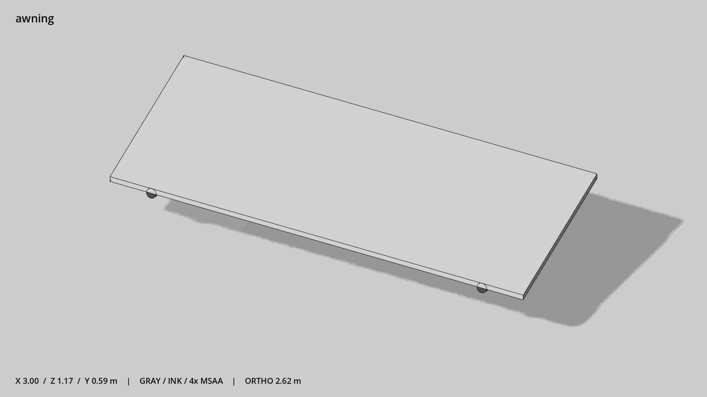

# 立面雨棚 · `awning`



- 模型：[GLB](../../../../models/awning.glb)
- 重建脚本：[build_awning.py](../../../build_awning.py)；尺寸在开头 `P` 中。
- 依赖：[model_geometry.py](../../../model_geometry.py)
- 实测尺寸：X 宽 **3** × Z 深 **1.168** × Y 高 **0.589** 米。
- 色槽：`fabric`, `metal_dark`。
- 原点：底部接触平面中心；立面和屋顶配件由场景另给安装高度。 +Y 向上，正面/车头/使用面朝 +Z。
- 几何：260 三角面，3 个封闭零件或规范允许的贴花片。
- 设计：有厚度的布篷与两根斜撑；以支撑最低点为安装高度基准。
- 交互参考：无预埋交互节点；由类型库以后标注。
- 来源：本项目原创脚本基本体建模；未使用第三方模型、纹理或生成服务。
- 检查：PASS；0 WARN。无警告。
- 复现：完整重跑后 GLB SHA-256 逐字节相同。

完整检查输出（同时保存为 [awning.txt](awning.txt)）：

```text
== C:\Users\Hsinlung\Desktop\news-game\godot\models\awning.glb
   size  x 3.000  y 0.589  z 1.168 m
   box   min (-1.500, 0.001, -0.584)  max (1.500, 0.590, 0.584)
   triangles 260: fabric 12, metal_dark 248
   PASS
   EXTRA: outward volume and normal/winding consistency PASS
   SHA256 3afb9b69ad0cfe9043b766516d85e3fb74cf34785b299269fcc6bad6437ad381
   REBUILD IDENTICAL
```
