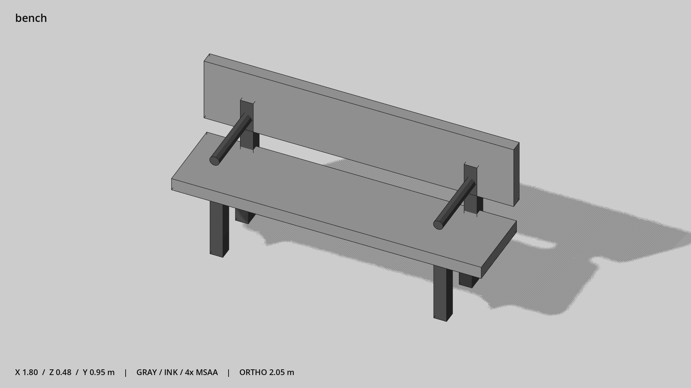

# 公园长椅 · `bench`



- 模型：[GLB](../../../../models/bench.glb)
- 重建脚本：[build_bench.py](../../../build_bench.py)；尺寸在开头 `P` 中。
- 依赖：[model_geometry.py](../../../model_geometry.py)
- 实测尺寸：X 宽 **1.8** × Z 深 **0.478** × Y 高 **0.95** 米。
- 色槽：`metal_dark`, `wood`。
- 原点：底部接触平面中心；立面和屋顶配件由场景另给安装高度。 +Y 向上，正面/车头/使用面朝 +Z。
- 几何：344 三角面，10 个封闭零件或规范允许的贴花片。
- 设计：整块简洁座板与靠背，两端扶手；坐向 +Z。
- 交互参考：座面 y=0.45，建议坐点 x=±0.45、z=0。
- 来源：本项目原创脚本基本体建模；未使用第三方模型、纹理或生成服务。
- 检查：PASS；0 WARN。无警告。
- 复现：完整重跑后 GLB SHA-256 逐字节相同。

完整检查输出（同时保存为 [bench.txt](bench.txt)）：

```text
== C:\Users\Hsinlung\Desktop\news-game\godot\models\bench.glb
   size  x 1.800  y 0.950  z 0.478 m
   box   min (-0.900, 0.000, -0.258)  max (0.900, 0.950, 0.220)
   triangles 344: metal_dark 320, wood 24
   PASS
   EXTRA: outward volume and normal/winding consistency PASS
   SHA256 f5522501be7305303e4e500c85c8e7271af15d33568ca8c4773091258591795f
   REBUILD IDENTICAL
```
