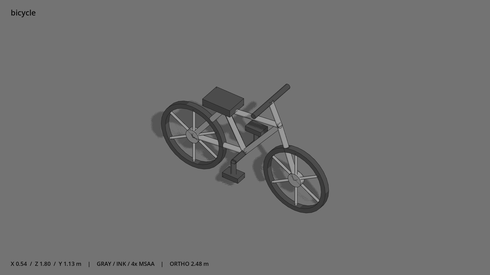

# 自行车 · `bicycle`



- 模型：[GLB](../../../../models/bicycle.glb)
- 重建脚本：[build_bicycle.py](../../../build_bicycle.py)；尺寸在开头 `P` 中。
- 依赖：[model_geometry.py](../../../model_geometry.py)、[vehicle_geometry.py](../../../vehicle_geometry.py)
- 实测尺寸：X 宽 **0.54** × Z 深 **1.8** × Y 高 **1.125** 米。
- 色槽：`metal`, `metal_dark`。
- 原点：底部接触平面中心；立面和屋顶配件由场景另给安装高度。 +Y 向上，正面/车头/使用面朝 +Z。
- 几何：3028 三角面，25 个封闭零件或规范允许的贴花片。
- 设计：双三角车架、空心轮胎、三根粗辐条、车座与车把；少量承重细杆低于 5 cm 是辨识轮廓所需。轮子、曲柄、左右脚踏是独立节点，可转动。
- 交互参考：骑乘接触点按节点名从模型读取（saddle / handlebar / crank_set / pedal_left / pedal_right / wheel_front / wheel_rear），见 模型制作说明.md“可骑的车”；类型 types/bicycle.tscn。
- 来源：本项目原创脚本基本体建模；未使用第三方模型、纹理或生成服务。
- 检查：PASS；0 WARN。无警告。
- 复现：完整重跑后 GLB SHA-256 逐字节相同。

完整检查输出（同时保存为 [bicycle.txt](bicycle.txt)）：

```text
== C:\Users\Hsinlung\Desktop\news-game\godot\models\bicycle.glb
   size  x 0.540  y 1.125  z 1.800 m
   box   min (-0.270, -0.000, -0.900)  max (0.270, 1.125, 0.900)
   triangles 3028: metal 1984, metal_dark 1044
   PASS
   EXTRA: outward volume and normal/winding consistency PASS
   SHA256 d1bd0697f51ef72c6644daefa280bfbc1cec3c61f0571bd7b283efaf87f31d8e
   REBUILD IDENTICAL
```
