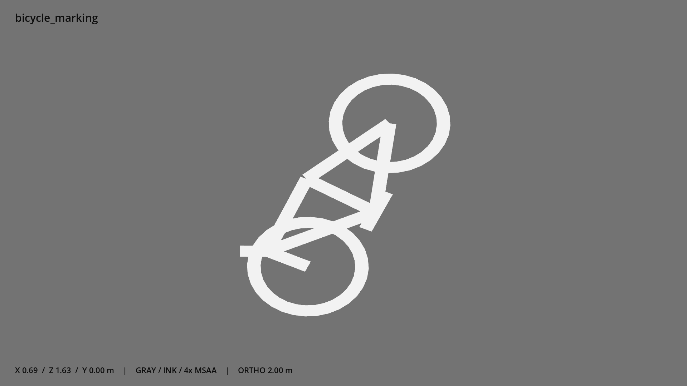

# 自行车道标志 · `bicycle_marking`



- 模型：[GLB](../../../../models/bicycle_marking.glb)
- 重建脚本：[build_bicycle_marking.py](../../../build_bicycle_marking.py)；尺寸在开头 `P` 中。
- 依赖：[model_geometry.py](../../../model_geometry.py)
- 实测尺寸：X 宽 **0.69** × Z 深 **1.63** × Y 高 **0** 米。
- 色槽：`paint`。
- 原点：底部接触平面中心；立面和屋顶配件由场景另给安装高度。 +Y 向上，正面/车头/使用面朝 +Z。
- 几何：144 三角面，10 个封闭零件或规范允许的贴花片。
- 设计：几何剪影贴花，沿 Z 方向行车；未使用颜色贴图。
- 交互参考：无预埋交互节点；由类型库以后标注。
- 来源：本项目原创脚本基本体建模；未使用第三方模型、纹理或生成服务。
- 检查：PASS；0 WARN。无警告。
- 复现：完整重跑后 GLB SHA-256 逐字节相同。

完整检查输出（同时保存为 [bicycle_marking.txt](bicycle_marking.txt)）：

```text
== C:\Users\Hsinlung\Desktop\news-game\godot\models\bicycle_marking.glb
   size  x 0.690  y 0.000  z 1.630 m
   box   min (-0.375, 0.003, -0.815)  max (0.315, 0.003, 0.815)
   triangles 144: paint 144
   PASS
   EXTRA: outward volume and normal/winding consistency PASS
   SHA256 c61b749e58ad155028803c8ec246f28559648c3cb679e2150f57e76a8650d3b4
   REBUILD IDENTICAL
```
