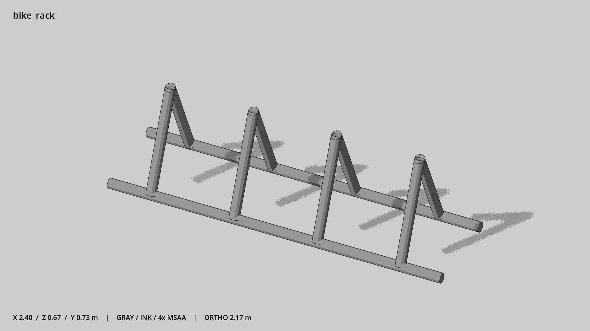

# 自行车停车架 · `bike_rack`



- 模型：[GLB](../../../../models/bike_rack.glb)
- 重建脚本：[build_bike_rack.py](../../../build_bike_rack.py)；尺寸在开头 `P` 中。
- 依赖：[model_geometry.py](../../../model_geometry.py)
- 实测尺寸：X 宽 **2.4** × Z 深 **0.67** × Y 高 **0.729** 米。
- 色槽：`metal`。
- 原点：底部接触平面中心；立面和屋顶配件由场景另给安装高度。 +Y 向上，正面/车头/使用面朝 +Z。
- 几何：1240 三角面，10 个封闭零件或规范允许的贴花片。
- 设计：四组斜架，分格停放；无需车轮动画。
- 交互参考：无预埋交互节点；由类型库以后标注。
- 来源：本项目原创脚本基本体建模；未使用第三方模型、纹理或生成服务。
- 检查：PASS；0 WARN。无警告。
- 复现：完整重跑后 GLB SHA-256 逐字节相同。

完整检查输出（同时保存为 [bike_rack.txt](bike_rack.txt)）：

```text
== C:\Users\Hsinlung\Desktop\news-game\godot\models\bike_rack.glb
   size  x 2.400  y 0.729  z 0.670 m
   box   min (-1.200, -0.000, -0.335)  max (1.200, 0.729, 0.335)
   triangles 1240: metal 1240
   PASS
   EXTRA: outward volume and normal/winding consistency PASS
   SHA256 8e24893001c546e7c220c710b3625becf82157e098c30d42fae0e57a9ead0866
   REBUILD IDENTICAL
```
