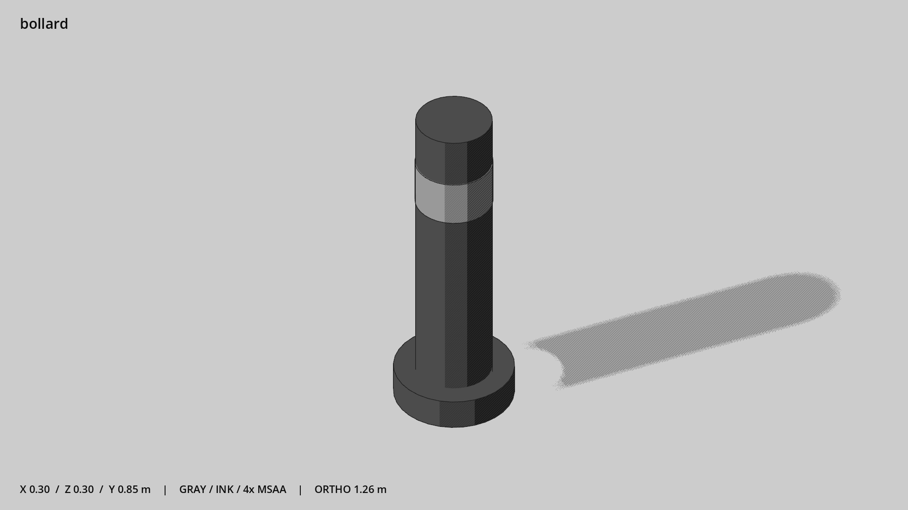

# 护柱 · `bollard`



- 模型：[GLB](../../../../models/bollard.glb)
- 重建脚本：[build_bollard.py](../../../build_bollard.py)；尺寸在开头 `P` 中。
- 依赖：[model_geometry.py](../../../model_geometry.py)
- 实测尺寸：X 宽 **0.3** × Z 深 **0.3** × Y 高 **0.85** 米。
- 色槽：`metal`, `metal_dark`。
- 原点：底部接触平面中心；立面和屋顶配件由场景另给安装高度。 +Y 向上，正面/车头/使用面朝 +Z。
- 几何：372 三角面，3 个封闭零件或规范允许的贴花片。
- 设计：简化的封闭块体，无纹理。
- 交互参考：无预埋交互节点；由类型库以后标注。
- 来源：本项目原创脚本基本体建模；未使用第三方模型、纹理或生成服务。
- 检查：PASS；0 WARN。无警告。
- 复现：完整重跑后 GLB SHA-256 逐字节相同。

完整检查输出（同时保存为 [bollard.txt](bollard.txt)）：

```text
== C:\Users\Hsinlung\Desktop\news-game\godot\models\bollard.glb
   size  x 0.300  y 0.850  z 0.300 m
   box   min (-0.150, 0.000, -0.150)  max (0.150, 0.850, 0.150)
   triangles 372: metal 124, metal_dark 248
   PASS
   EXTRA: outward volume and normal/winding consistency PASS
   SHA256 0f5371d8316a82eeab768d235356c18241ce3f0ea7f4cd2caa10e819ae0ff534
   REBUILD IDENTICAL
```
