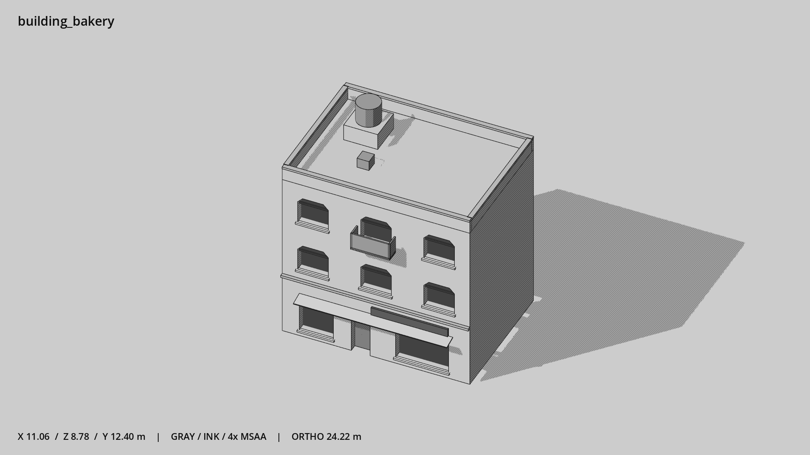

# 面包店 · `building_bakery`



- 模型：[GLB](../../../../models/building_bakery.glb)
- 重建脚本：[build_building_bakery.py](../../../build_building_bakery.py)；尺寸在开头 `P` 中。
- 依赖：[model_geometry.py](../../../model_geometry.py)、[building_geometry.py](../../../building_geometry.py)
- 实测尺寸：X 宽 **11.06** × Z 深 **8.78** × Y 高 **12.4** 米。
- 色槽：`concrete`, `door`, `fabric`, `metal`, `metal_dark`, `trim`, `trim_dark`, `wall_plaster`, `window`。
- 原点：正面墙脚中点；正面墙 z=0，主体向 -Z 延伸。 +Y 向上，正面/车头/使用面朝 +Z。
- 几何：866 三角面，42 个封闭零件或规范允许的贴花片。
- 设计：3 层、不对称双橱窗、偏左入口、顶层单阳台、低水箱。本次修订：切角窗与高横档，浅抹灰墙。
- 交互参考：门槛 (-0.9,0,0)，门外站位 (-0.9,0,1.1)。
- 来源：本项目原创脚本基本体建模；未使用第三方模型、纹理或生成服务。
- 检查：PASS；0 WARN。无警告。
- 复现：完整重跑后 GLB SHA-256 逐字节相同。

完整检查输出（同时保存为 [building_bakery.txt](building_bakery.txt)）：

```text
== C:\Users\Hsinlung\Desktop\news-game\godot\models\building_bakery.glb
   size  x 11.060  y 12.400  z 8.780 m
   box   min (-5.530, 0.000, -8.030)  max (5.530, 12.400, 0.750)
   triangles 866: concrete 72, door 12, fabric 12, metal 172, metal_dark 72, trim 96, trim_dark 12, wall_plaster 274, window 144
   PASS
   EXTRA: outward volume and normal/winding consistency PASS
   SHA256 c8d50b035f5e5414df1a16708c69f83424cd9f6d2db7ba821dad6e1d430d61b7
   REBUILD IDENTICAL
```
