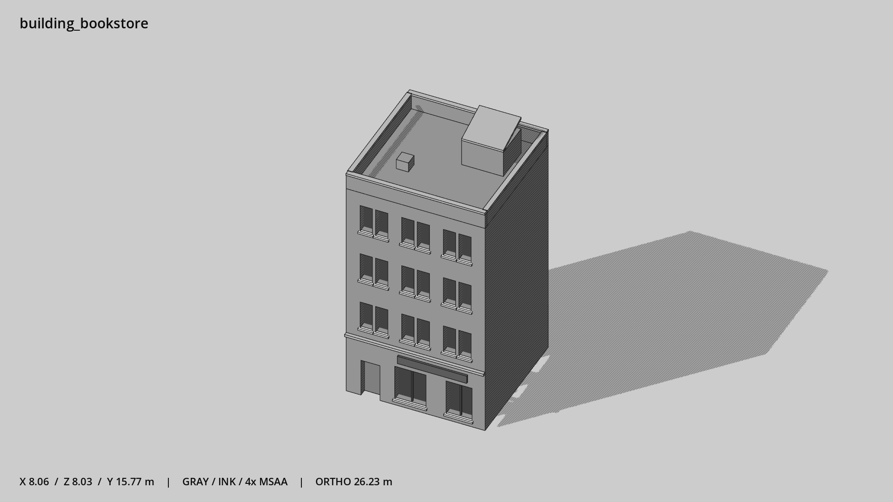

# 书店 · `building_bookstore`



- 模型：[GLB](../../../../models/building_bookstore.glb)
- 重建脚本：[build_building_bookstore.py](../../../build_building_bookstore.py)；尺寸在开头 `P` 中。
- 依赖：[model_geometry.py](../../../model_geometry.py)、[building_geometry.py](../../../building_geometry.py)
- 实测尺寸：X 宽 **8.06** × Z 深 **8.03** × Y 高 **15.77** 米。
- 色槽：`concrete`, `door`, `metal`, `metal_dark`, `trim`, `trim_dark`, `wall_brick`, `window`。
- 原点：正面墙脚中点；正面墙 z=0，主体向 -Z 延伸。 +Y 向上，正面/车头/使用面朝 +Z。
- 几何：1024 三角面，57 个封闭零件或规范允许的贴花片。
- 设计：4 层、左侧入口、不等宽陈列窗、高女儿墙与斜顶楼梯间。本次修订：成对窄窗，深砖墙。
- 交互参考：门槛 (-2.6,0,0)，门外站位 (-2.6,0,1.1)。
- 来源：本项目原创脚本基本体建模；未使用第三方模型、纹理或生成服务。
- 检查：PASS；0 WARN。无警告。
- 复现：完整重跑后 GLB SHA-256 逐字节相同。

完整检查输出（同时保存为 [building_bookstore.txt](building_bookstore.txt)）：

```text
== C:\Users\Hsinlung\Desktop\news-game\godot\models\building_bookstore.glb
   size  x 8.060  y 15.770  z 8.030 m
   box   min (-4.030, 0.000, -7.830)  max (4.030, 15.770, 0.200)
   triangles 1024: concrete 72, door 12, metal 12, metal_dark 24, trim 240, trim_dark 12, wall_brick 412, window 240
   PASS
   EXTRA: outward volume and normal/winding consistency PASS
   SHA256 b1f2e02bfb358629258e351e9f1869b8173b549fcb16af3d6e384fee88e92aa9
   REBUILD IDENTICAL
```
