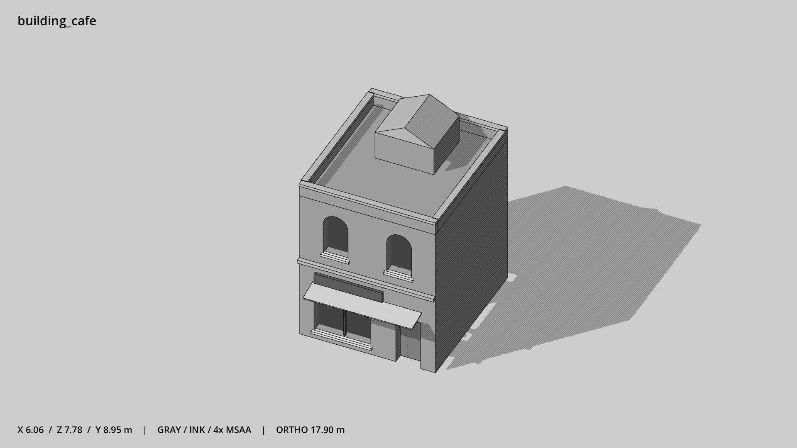

# 咖啡馆 · `building_cafe`



- 模型：[GLB](../../../../models/building_cafe.glb)
- 重建脚本：[build_building_cafe.py](../../../build_building_cafe.py)；尺寸在开头 `P` 中。
- 依赖：[model_geometry.py](../../../model_geometry.py)、[building_geometry.py](../../../building_geometry.py)
- 实测尺寸：X 宽 **6.06** × Z 深 **7.78** × Y 高 **8.95** 米。
- 色槽：`concrete`, `door`, `fabric`, `metal_dark`, `trim`, `trim_dark`, `wall_stone`, `window`。
- 原点：正面墙脚中点；正面墙 z=0，主体向 -Z 延伸。 +Y 向上，正面/车头/使用面朝 +Z。
- 几何：684 三角面，22 个封闭零件或规范允许的贴花片。
- 设计：2 层窄铺、右门左窗、双上窗、小布篷与山墙屋顶房。本次修订：上下层拱窗，石墙。
- 交互参考：门槛 (1.8,0,0)，门外站位 (1.8,0,1.1)。
- 来源：本项目原创脚本基本体建模；未使用第三方模型、纹理或生成服务。
- 检查：PASS；0 WARN。无警告。
- 复现：完整重跑后 GLB SHA-256 逐字节相同。

完整检查输出（同时保存为 [building_cafe.txt](building_cafe.txt)）：

```text
== C:\Users\Hsinlung\Desktop\news-game\godot\models\building_cafe.glb
   size  x 6.060  y 8.950  z 7.780 m
   box   min (-3.030, 0.000, -6.830)  max (3.030, 8.950, 0.950)
   triangles 684: concrete 68, door 12, fabric 12, metal_dark 12, trim 36, trim_dark 12, wall_stone 316, window 216
   PASS
   EXTRA: outward volume and normal/winding consistency PASS
   SHA256 14d8829b1cdeac6ab8651c0727d268e47c1049ca3eca0bb463a0c81daca115b3
   REBUILD IDENTICAL
```
