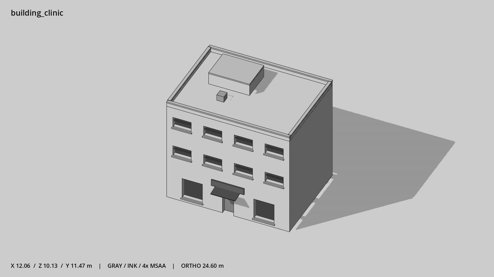

# 诊所 · `building_clinic`



- 模型：[GLB](../../../../models/building_clinic.glb)
- 重建脚本：[build_building_clinic.py](../../../build_building_clinic.py)；尺寸在开头 `P` 中。
- 依赖：[model_geometry.py](../../../model_geometry.py)、[building_geometry.py](../../../building_geometry.py)
- 实测尺寸：X 宽 **12.06** × Z 深 **10.13** × Y 高 **11.47** 米。
- 色槽：`concrete`, `door`, `metal`, `metal_dark`, `trim_dark`, `wall_plaster`, `window`。
- 原点：正面墙脚中点；正面墙 z=0，主体向 -Z 延伸。 +Y 向上，正面/车头/使用面朝 +Z。
- 几何：696 三角面，43 个封闭零件或规范允许的贴花片。
- 设计：3 层、对称入口和独立门廊、四列矮窗、宽机房；空白诊所招牌。本次修订：低矮横窗与水平分格，浅抹灰墙。
- 交互参考：门槛 (0,0,0)，门外站位 (0,0,1.1)。
- 来源：本项目原创脚本基本体建模；未使用第三方模型、纹理或生成服务。
- 检查：PASS；0 WARN。无警告。
- 复现：完整重跑后 GLB SHA-256 逐字节相同。

完整检查输出（同时保存为 [building_clinic.txt](building_clinic.txt)）：

```text
== C:\Users\Hsinlung\Desktop\news-game\godot\models\building_clinic.glb
   size  x 12.060  y 11.470  z 10.130 m
   box   min (-6.030, 0.000, -9.030)  max (6.030, 11.470, 1.100)
   triangles 696: concrete 180, door 12, metal 12, metal_dark 108, trim_dark 12, wall_plaster 252, window 120
   PASS
   EXTRA: outward volume and normal/winding consistency PASS
   SHA256 f73532d2e21f8818024c7cd59fa94efe71660e3c7c51dc9173759e5ef85db076
   REBUILD IDENTICAL
```
