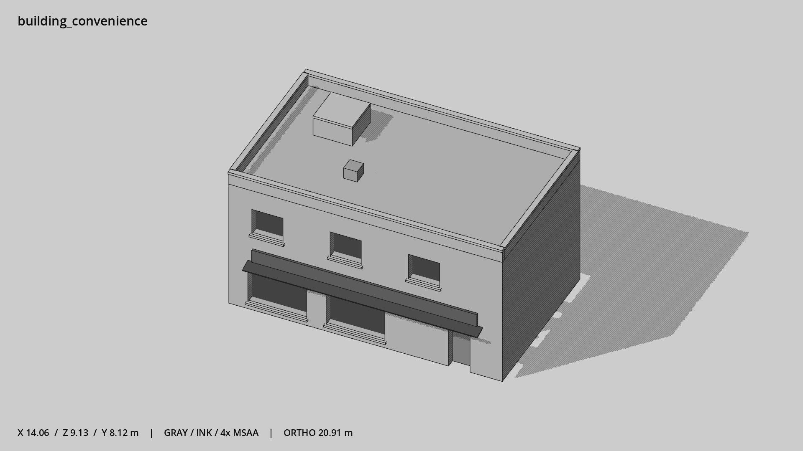

# 便利店 · `building_convenience`



- 模型：[GLB](../../../../models/building_convenience.glb)
- 重建脚本：[build_building_convenience.py](../../../build_building_convenience.py)；尺寸在开头 `P` 中。
- 依赖：[model_geometry.py](../../../model_geometry.py)、[building_geometry.py](../../../building_geometry.py)
- 实测尺寸：X 宽 **14.06** × Z 深 **9.13** × Y 高 **8.12** 米。
- 色槽：`concrete`, `door`, `metal`, `metal_dark`, `trim_dark`, `wall`, `window`。
- 原点：正面墙脚中点；正面墙 z=0，主体向 -Z 延伸。 +Y 向上，正面/车头/使用面朝 +Z。
- 几何：400 三角面，25 个封闭零件或规范允许的贴花片。
- 设计：2 层宽铺面、右侧入口、连续暗色门头、三个错位上窗、低机房。本次修订：方窗无分格，中灰墙。
- 交互参考：门槛 (4.8,0,0)，门外站位 (4.8,0,1.1)。
- 来源：本项目原创脚本基本体建模；未使用第三方模型、纹理或生成服务。
- 检查：PASS；0 WARN。无警告。
- 复现：完整重跑后 GLB SHA-256 逐字节相同。

完整检查输出（同时保存为 [building_convenience.txt](building_convenience.txt)）：

```text
== C:\Users\Hsinlung\Desktop\news-game\godot\models\building_convenience.glb
   size  x 14.060  y 8.120  z 9.130 m
   box   min (-7.030, 0.000, -8.530)  max (7.030, 8.120, 0.600)
   triangles 400: concrete 120, door 12, metal 12, metal_dark 12, trim_dark 12, wall 172, window 60
   PASS
   EXTRA: outward volume and normal/winding consistency PASS
   SHA256 b8a277ae4cbf4458a4520761c7f96af42ec781aed8a1f3c1f1fbd2dfc4a43fd9
   REBUILD IDENTICAL
```
