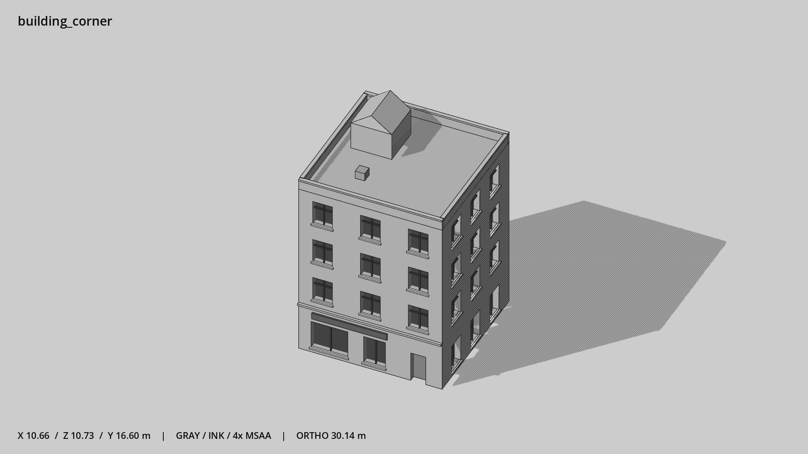

# 双立面转角楼 · `building_corner`



- 模型：[GLB](../../../../models/building_corner.glb)
- 重建脚本：[build_building_corner.py](../../../build_building_corner.py)；尺寸在开头 `P` 中。
- 依赖：[model_geometry.py](../../../model_geometry.py)、[building_geometry.py](../../../building_geometry.py)
- 实测尺寸：X 宽 **10.66** × Z 深 **10.73** × Y 高 **16.6** 米。
- 色槽：`concrete`, `door`, `metal`, `metal_dark`, `trim`, `trim_dark`, `wall`, `window`。
- 原点：正面墙脚中点；正面墙 z=0，主体向 -Z 延伸。 +Y 向上，正面/车头/使用面朝 +Z。
- 几何：1616 三角面，102 个封闭零件或规范允许的贴花片。
- 设计：4 层；+Z 与 +X 两个完整凹窗立面；角端入口、高山墙楼梯间。本次修订：双立面十字分格窗，中灰墙。
- 交互参考：门槛 (3.5,0,0)，门外站位 (3.5,0,1.1)。
- 来源：本项目原创脚本基本体建模；未使用第三方模型、纹理或生成服务。
- 检查：PASS；0 WARN。无警告。
- 复现：完整重跑后 GLB SHA-256 逐字节相同。

完整检查输出（同时保存为 [building_corner.txt](building_corner.txt)）：

```text
== C:\Users\Hsinlung\Desktop\news-game\godot\models\building_corner.glb
   size  x 10.660  y 16.600  z 10.730 m
   box   min (-5.280, 0.000, -10.530)  max (5.380, 16.600, 0.200)
   triangles 1616: concrete 68, door 12, metal 12, metal_dark 492, trim 276, trim_dark 12, wall 468, window 276
   PASS
   EXTRA: outward volume and normal/winding consistency PASS
   SHA256 8ed215b6eae0b1a75d5627bcad40776fcf62d9afca718f278253614e37926b8c
   REBUILD IDENTICAL
```
