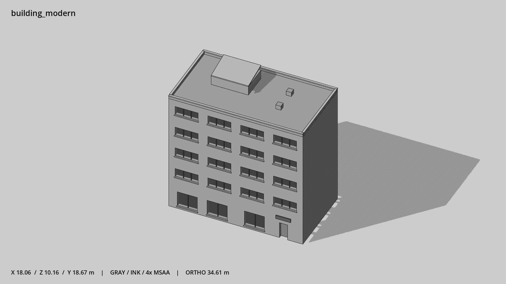

# 现代办公楼 · `building_modern`



- 模型：[GLB](../../../../models/building_modern.glb)
- 重建脚本：[build_building_modern.py](../../../build_building_modern.py)；尺寸在开头 `P` 中。
- 依赖：[model_geometry.py](../../../model_geometry.py)、[building_geometry.py](../../../building_geometry.py)
- 实测尺寸：X 宽 **18.06** × Z 深 **10.16** × Y 高 **18.67** 米。
- 色槽：`concrete`, `door`, `metal`, `metal_dark`, `trim_dark`, `wall_stone`, `window`。
- 原点：正面墙脚中点；正面墙 z=0，主体向 -Z 延伸。 +Y 向上，正面/车头/使用面朝 +Z。
- 几何：1378 三角面，88 个封闭零件或规范允许的贴花片。
- 设计：5 层、四列宽分隔窗、右侧门厅、低女儿墙、斜顶机房；玻璃占立面约三成以内。本次修订：宽横窗三分格，石墙。
- 交互参考：门槛 (6.4,0,0)，门外站位 (6.4,0,1.1)。
- 来源：本项目原创脚本基本体建模；未使用第三方模型、纹理或生成服务。
- 检查：PASS；0 WARN。无警告。
- 复现：完整重跑后 GLB SHA-256 逐字节相同。

完整检查输出（同时保存为 [building_modern.txt](building_modern.txt)）：

```text
== C:\Users\Hsinlung\Desktop\news-game\godot\models\building_modern.glb
   size  x 18.060  y 18.670  z 10.160 m
   box   min (-9.030, 0.000, -10.030)  max (9.030, 18.670, 0.130)
   triangles 1378: concrete 288, door 12, metal 24, metal_dark 420, trim_dark 12, wall_stone 394, window 228
   PASS
   EXTRA: outward volume and normal/winding consistency PASS
   SHA256 76963e26057daab64aeb6b0bb651c222ff68c5dec528343bc4b200ee6675ffbd
   REBUILD IDENTICAL
```
