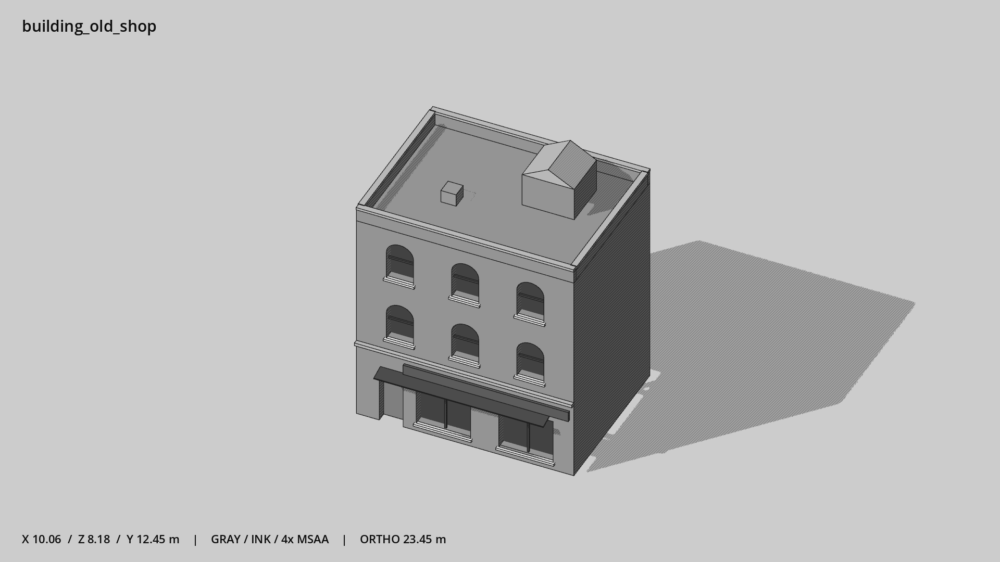

# 老式底商 · `building_old_shop`



- 模型：[GLB](../../../../models/building_old_shop.glb)
- 重建脚本：[build_building_old_shop.py](../../../build_building_old_shop.py)；尺寸在开头 `P` 中。
- 依赖：[model_geometry.py](../../../model_geometry.py)、[building_geometry.py](../../../building_geometry.py)
- 实测尺寸：X 宽 **10.06** × Z 深 **8.18** × Y 高 **12.45** 米。
- 色槽：`concrete`, `door`, `metal`, `metal_dark`, `trim`, `trim_dark`, `wall_brick`, `window`。
- 原点：正面墙脚中点；正面墙 z=0，主体向 -Z 延伸。 +Y 向上，正面/车头/使用面朝 +Z。
- 几何：1352 三角面，40 个封闭零件或规范允许的贴花片。
- 设计：3 层、左入口、三列分隔窗、坡顶楼梯间、宽店招与金属挑棚。本次修订：圆拱窗与拱下横档，深砖墙。
- 交互参考：门槛 (-3.4,0,0)，门外站位 (-3.4,0,1.1)。
- 来源：本项目原创脚本基本体建模；未使用第三方模型、纹理或生成服务。
- 检查：PASS；0 WARN。无警告。
- 复现：完整重跑后 GLB SHA-256 逐字节相同。

完整检查输出（同时保存为 [building_old_shop.txt](building_old_shop.txt)）：

```text
== C:\Users\Hsinlung\Desktop\news-game\godot\models\building_old_shop.glb
   size  x 10.060  y 12.450  z 8.180 m
   box   min (-5.030, 0.000, -7.530)  max (5.030, 12.450, 0.650)
   triangles 1352: concrete 68, door 12, metal 12, metal_dark 108, trim 96, trim_dark 12, wall_brick 588, window 456
   PASS
   EXTRA: outward volume and normal/winding consistency PASS
   SHA256 32f7acbd5a8ff558d5356303c1f43e4cac869dd908472c8ec56dc5a2025f5d45
   REBUILD IDENTICAL
```
