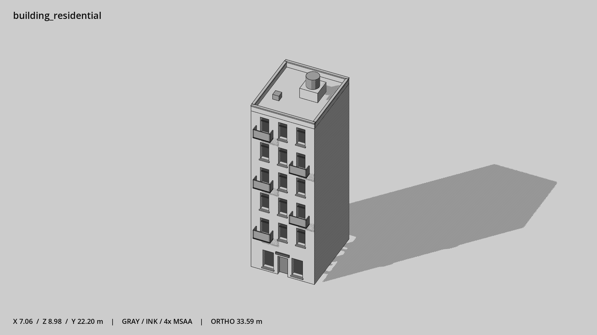

# 窄高住宅 · `building_residential`



- 模型：[GLB](../../../../models/building_residential.glb)
- 重建脚本：[build_building_residential.py](../../../build_building_residential.py)；尺寸在开头 `P` 中。
- 依赖：[model_geometry.py](../../../model_geometry.py)、[building_geometry.py](../../../building_geometry.py)
- 实测尺寸：X 宽 **7.06** × Z 深 **8.98** × Y 高 **22.2** 米。
- 色槽：`concrete`, `door`, `metal`, `metal_dark`, `trim_dark`, `wall_plaster`, `window`。
- 原点：正面墙脚中点；正面墙 z=0，主体向 -Z 延伸。 +Y 向上，正面/车头/使用面朝 +Z。
- 几何：1408 三角面，83 个封闭零件或规范允许的贴花片。
- 设计：6 层、三列窄窗、交错阳台、屋顶水箱；住宅门厅，无大橱窗。本次修订：高窄窗配高位横档，浅抹灰墙。
- 交互参考：门槛 (0,0,0)，门外站位 (0,0,1.1)。
- 来源：本项目原创脚本基本体建模；未使用第三方模型、纹理或生成服务。
- 检查：PASS；0 WARN。无警告。
- 复现：完整重跑后 GLB SHA-256 逐字节相同。

完整检查输出（同时保存为 [building_residential.txt](building_residential.txt)）：

```text
== C:\Users\Hsinlung\Desktop\news-game\godot\models\building_residential.glb
   size  x 7.060  y 22.200  z 8.980 m
   box   min (-3.530, 0.000, -8.230)  max (3.530, 22.200, 0.750)
   triangles 1408: concrete 312, door 12, metal 316, metal_dark 180, trim_dark 12, wall_plaster 372, window 204
   PASS
   EXTRA: outward volume and normal/winding consistency PASS
   SHA256 9fd9c672a2ac7bb28cae0d04bed5a3d1d2b6fe9fdf49db88b0c27f276e52612b
   REBUILD IDENTICAL
```
