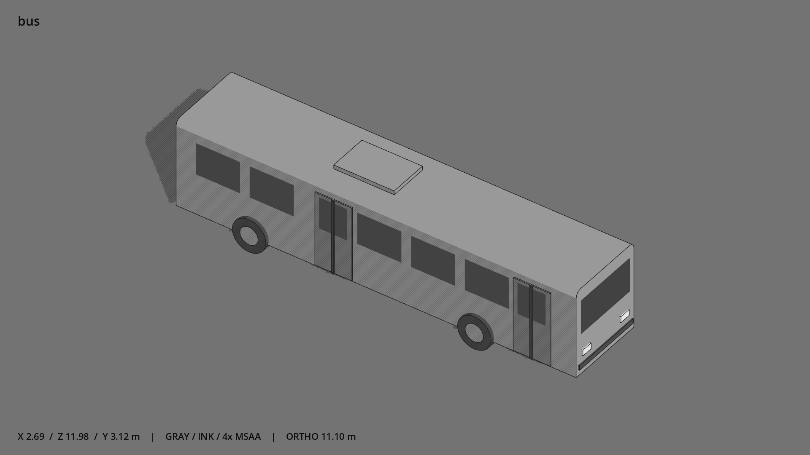

# 公交车 · `bus`



- 模型：[GLB](../../../../models/bus.glb)
- 重建脚本：[build_bus.py](../../../build_bus.py)；尺寸在开头 `P` 中。
- 依赖：[model_geometry.py](../../../model_geometry.py)、[vehicle_geometry.py](../../../vehicle_geometry.py)
- 实测尺寸：X 宽 **2.687** × Z 深 **11.98** × Y 高 **3.12** 米。
- 色槽：`accent`, `door`, `metal`, `metal_dark`, `trim_dark`, `window`。
- 原点：底部接触平面中心；立面和屋顶配件由场景另给安装高度。 +Y 向上，正面/车头/使用面朝 +Z。
- 几何：1340 三角面，35 个封闭零件或规范允许的贴花片。
- 设计：约 12×2.5×3 米；车头 +Z，司机右侧为 -X，两道门位于该侧；金属圆肩顶。前门中心 z=4.65，前轴 z=3.0；门缘与轮缘纵向净距 0.60 米。
- 交互参考：门外点约 (-1.7,0,4.2)、(-1.7,0,-1.25)，车门暂不动画。
- 来源：本项目原创脚本基本体建模；未使用第三方模型、纹理或生成服务。
- 检查：PASS；0 WARN。无警告。
- 复现：完整重跑后 GLB SHA-256 逐字节相同。

完整检查输出（同时保存为 [bus.txt](bus.txt)）：

```text
== C:\Users\Hsinlung\Desktop\news-game\godot\models\bus.glb
   size  x 2.687  y 3.120  z 11.980 m
   box   min (-1.343, -0.000, -5.990)  max (1.343, 3.120, 5.990)
   triangles 1340: accent 24, door 24, metal 544, metal_dark 544, trim_dark 24, window 180
   PASS
   EXTRA: outward volume and normal/winding consistency PASS
   SHA256 3fc695f8567976d04724063f903c7bf883f39d7aa46d6d80d8b498290b305171
   REBUILD IDENTICAL
```
