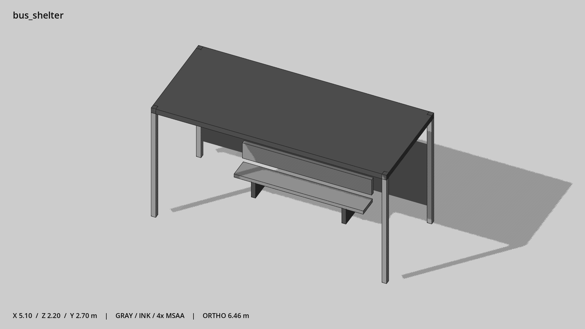

# 公交候车棚与长凳 · `bus_shelter`



- 模型：[GLB](../../../../models/bus_shelter.glb)
- 重建脚本：[build_bus_shelter.py](../../../build_bus_shelter.py)；尺寸在开头 `P` 中。
- 依赖：[model_geometry.py](../../../model_geometry.py)
- 实测尺寸：X 宽 **5.1** × Z 深 **2.2** × Y 高 **2.7** 米。
- 色槽：`metal`, `metal_dark`, `window`, `wood`。
- 原点：底部接触平面中心；立面和屋顶配件由场景另给安装高度。 +Y 向上，正面/车头/使用面朝 +Z。
- 几何：120 三角面，10 个封闭零件或规范允许的贴花片。
- 设计：5×2.1 米棚，长凳靠后，前部留候车空地；深色金属顶避免亮盖板。
- 交互参考：座面 y=0.45、z=-0.5；站位 x≈-1.8,-0.6,0.6,1.8，z≈0.45。
- 来源：本项目原创脚本基本体建模；未使用第三方模型、纹理或生成服务。
- 检查：PASS；0 WARN。无警告。
- 复现：完整重跑后 GLB SHA-256 逐字节相同。

完整检查输出（同时保存为 [bus_shelter.txt](bus_shelter.txt)）：

```text
== C:\Users\Hsinlung\Desktop\news-game\godot\models\bus_shelter.glb
   size  x 5.100  y 2.700  z 2.200 m
   box   min (-2.550, 0.000, -1.100)  max (2.550, 2.700, 1.100)
   triangles 120: metal 48, metal_dark 36, window 12, wood 24
   PASS
   EXTRA: outward volume and normal/winding consistency PASS
   SHA256 11b18cf7309b04c2b35bd10e86c84e56b420ceecdd289eb7fb6881e1a4b839b0
   REBUILD IDENTICAL
```
