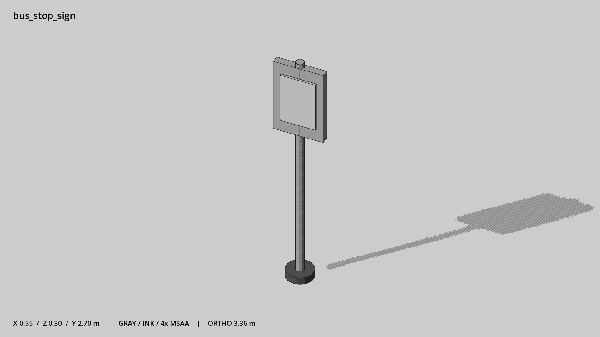

# 公交站牌 · `bus_stop_sign`



- 模型：[GLB](../../../../models/bus_stop_sign.glb)
- 重建脚本：[build_bus_stop_sign.py](../../../build_bus_stop_sign.py)；尺寸在开头 `P` 中。
- 依赖：[model_geometry.py](../../../model_geometry.py)
- 实测尺寸：X 宽 **0.55** × Z 深 **0.3** × Y 高 **2.7** 米。
- 色槽：`concrete`, `metal`, `metal_dark`。
- 原点：杆底中心。 +Y 向上，正面/车头/使用面朝 +Z。
- 几何：272 三角面，4 个封闭零件或规范允许的贴花片。
- 设计：独立站牌，空白面板；后续可由 UI 提供路线信息。
- 交互参考：无预埋交互节点；由类型库以后标注。
- 来源：本项目原创脚本基本体建模；未使用第三方模型、纹理或生成服务。
- 检查：PASS；0 WARN。无警告。
- 复现：完整重跑后 GLB SHA-256 逐字节相同。

完整检查输出（同时保存为 [bus_stop_sign.txt](bus_stop_sign.txt)）：

```text
== C:\Users\Hsinlung\Desktop\news-game\godot\models\bus_stop_sign.glb
   size  x 0.550  y 2.700  z 0.300 m
   box   min (-0.275, 0.000, -0.150)  max (0.275, 2.700, 0.150)
   triangles 272: concrete 12, metal 136, metal_dark 124
   PASS
   EXTRA: outward volume and normal/winding consistency PASS
   SHA256 872d35caedbf489844378cfad59941cc726313d89da1bd825299305940f34a18
   REBUILD IDENTICAL
```
