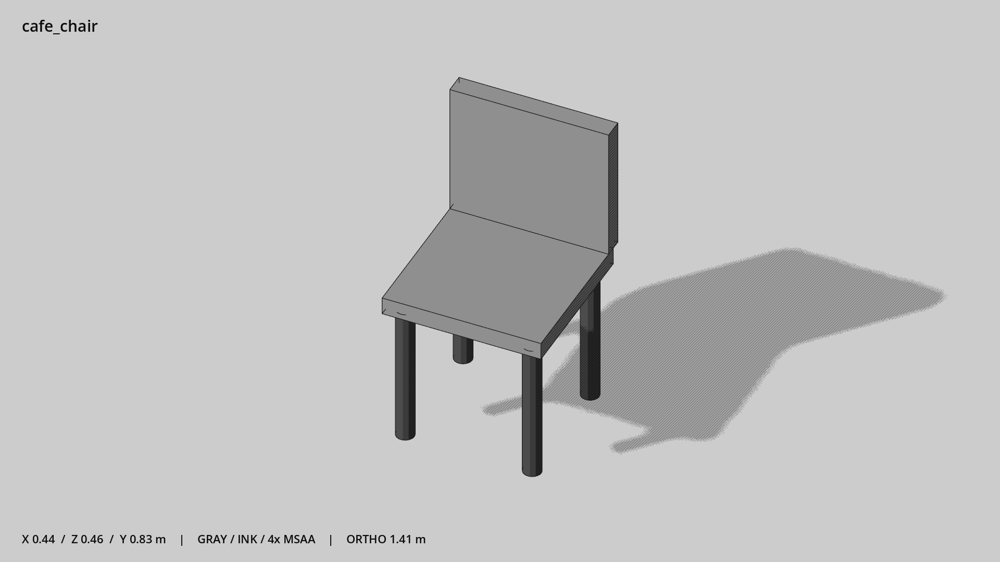

# 咖啡馆椅子 · `cafe_chair`



- 模型：[GLB](../../../../models/cafe_chair.glb)
- 重建脚本：[build_cafe_chair.py](../../../build_cafe_chair.py)；尺寸在开头 `P` 中。
- 依赖：[model_geometry.py](../../../model_geometry.py)
- 实测尺寸：X 宽 **0.44** × Z 深 **0.458** × Y 高 **0.83** 米。
- 色槽：`metal_dark`, `wood`。
- 原点：底部接触平面中心；立面和屋顶配件由场景另给安装高度。 +Y 向上，正面/车头/使用面朝 +Z。
- 几何：520 三角面，6 个封闭零件或规范允许的贴花片。
- 设计：椅子坐向 +Z。
- 交互参考：座面中心 (0,0.45,0)。
- 来源：本项目原创脚本基本体建模；未使用第三方模型、纹理或生成服务。
- 检查：PASS；0 WARN。无警告。
- 复现：完整重跑后 GLB SHA-256 逐字节相同。

完整检查输出（同时保存为 [cafe_chair.txt](cafe_chair.txt)）：

```text
== C:\Users\Hsinlung\Desktop\news-game\godot\models\cafe_chair.glb
   size  x 0.440  y 0.830  z 0.458 m
   box   min (-0.220, 0.000, -0.243)  max (0.220, 0.830, 0.215)
   triangles 520: metal_dark 496, wood 24
   PASS
   EXTRA: outward volume and normal/winding consistency PASS
   SHA256 1a120066b66230577473032b13d299a4d0099173cec358e7629d833bad93c85b
   REBUILD IDENTICAL
```
