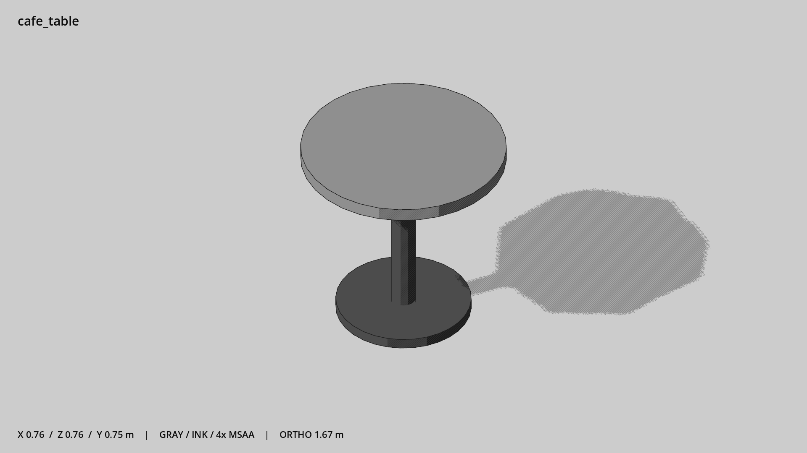

# 咖啡馆圆桌 · `cafe_table`



- 模型：[GLB](../../../../models/cafe_table.glb)
- 重建脚本：[build_cafe_table.py](../../../build_cafe_table.py)；尺寸在开头 `P` 中。
- 依赖：[model_geometry.py](../../../model_geometry.py)
- 实测尺寸：X 宽 **0.76** × Z 深 **0.76** × Y 高 **0.75** 米。
- 色槽：`metal_dark`, `wood`。
- 原点：底部接触平面中心；立面和屋顶配件由场景另给安装高度。 +Y 向上，正面/车头/使用面朝 +Z。
- 几何：372 三角面，3 个封闭零件或规范允许的贴花片。
- 设计：单独圆桌。
- 交互参考：桌面 y=0.75。
- 来源：本项目原创脚本基本体建模；未使用第三方模型、纹理或生成服务。
- 检查：PASS；0 WARN。无警告。
- 复现：完整重跑后 GLB SHA-256 逐字节相同。

完整检查输出（同时保存为 [cafe_table.txt](cafe_table.txt)）：

```text
== C:\Users\Hsinlung\Desktop\news-game\godot\models\cafe_table.glb
   size  x 0.760  y 0.750  z 0.760 m
   box   min (-0.380, 0.000, -0.380)  max (0.380, 0.750, 0.380)
   triangles 372: metal_dark 248, wood 124
   PASS
   EXTRA: outward volume and normal/winding consistency PASS
   SHA256 65dbd9f9ef01058f4bd841f84adf45660525e58824a73238b06e79cf03426bd1
   REBUILD IDENTICAL
```
