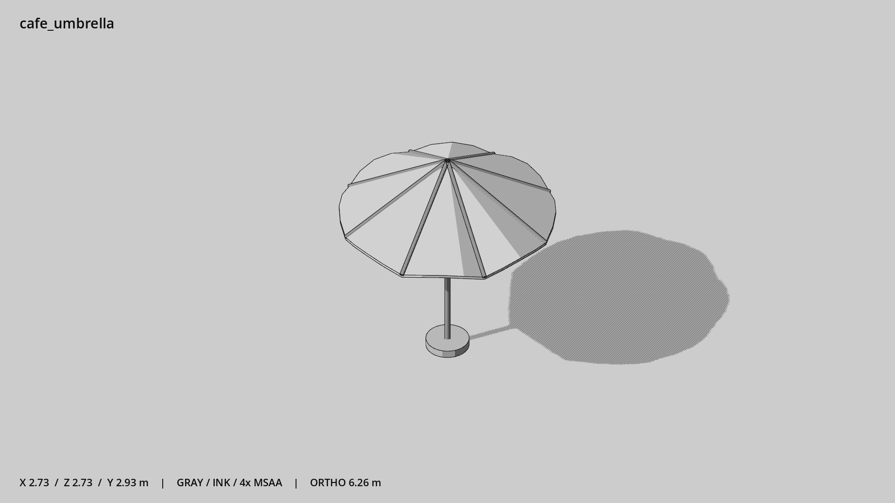

# 咖啡馆遮阳伞 · `cafe_umbrella`



- 模型：[GLB](../../../../models/cafe_umbrella.glb)
- 重建脚本：[build_cafe_umbrella.py](../../../build_cafe_umbrella.py)；尺寸在开头 `P` 中。
- 依赖：[model_geometry.py](../../../model_geometry.py)
- 实测尺寸：X 宽 **2.727** × Z 深 **2.727** × Y 高 **2.921** 米。
- 色槽：`concrete`, `fabric`, `metal`。
- 原点：底部接触平面中心；立面和屋顶配件由场景另给安装高度。 +Y 向上，正面/车头/使用面朝 +Z。
- 几何：1368 三角面，11 个封闭零件或规范允许的贴花片。
- 设计：薄而封闭的伞面，非填满的实心锥；独立重底座。伞面升高0.85米，坡度约32°；伞缘高2.05米。八根可见伞骨与起伏伞缘，改善俯视轮廓。
- 交互参考：无预埋交互节点；由类型库以后标注。
- 来源：本项目原创脚本基本体建模；未使用第三方模型、纹理或生成服务。
- 检查：PASS；0 WARN。无警告。
- 复现：完整重跑后 GLB SHA-256 逐字节相同。

完整检查输出（同时保存为 [cafe_umbrella.txt](cafe_umbrella.txt)）：

```text
== C:\Users\Hsinlung\Desktop\news-game\godot\models\cafe_umbrella.glb
   size  x 2.727  y 2.921  z 2.727 m
   box   min (-1.363, 0.000, -1.363)  max (1.363, 2.921, 1.363)
   triangles 1368: concrete 124, fabric 128, metal 1116
   PASS
   EXTRA: outward volume and normal/winding consistency PASS
   SHA256 9a8f55e26bea0a910f01cb50822d0b1d214c98f1cb2d126450af4c86740e3c22
   REBUILD IDENTICAL
```
