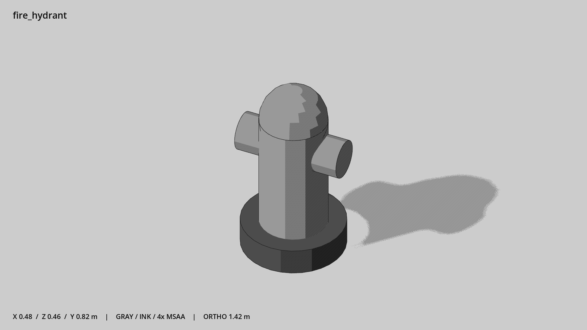

# 消防栓 · `fire_hydrant`



- 模型：[GLB](../../../../models/fire_hydrant.glb)
- 重建脚本：[build_fire_hydrant.py](../../../build_fire_hydrant.py)；尺寸在开头 `P` 中。
- 依赖：[model_geometry.py](../../../model_geometry.py)
- 实测尺寸：X 宽 **0.48** × Z 深 **0.46** × Y 高 **0.82** 米。
- 色槽：`metal`, `metal_dark`。
- 原点：底部接触平面中心；立面和屋顶配件由场景另给安装高度。 +Y 向上，正面/车头/使用面朝 +Z。
- 几何：812 三角面，4 个封闭零件或规范允许的贴花片。
- 设计：简化的封闭块体，无纹理。
- 交互参考：无预埋交互节点；由类型库以后标注。
- 来源：本项目原创脚本基本体建模；未使用第三方模型、纹理或生成服务。
- 检查：PASS；0 WARN。无警告。
- 复现：完整重跑后 GLB SHA-256 逐字节相同。

完整检查输出（同时保存为 [fire_hydrant.txt](fire_hydrant.txt)）：

```text
== C:\Users\Hsinlung\Desktop\news-game\godot\models\fire_hydrant.glb
   size  x 0.480  y 0.820  z 0.460 m
   box   min (-0.240, 0.000, -0.230)  max (0.240, 0.820, 0.230)
   triangles 812: metal 688, metal_dark 124
   PASS
   EXTRA: outward volume and normal/winding consistency PASS
   SHA256 86d43f4c9673675e321844fdc289bd779c2ce5f239055226c5a8d9085c2a6acc
   REBUILD IDENTICAL
```
