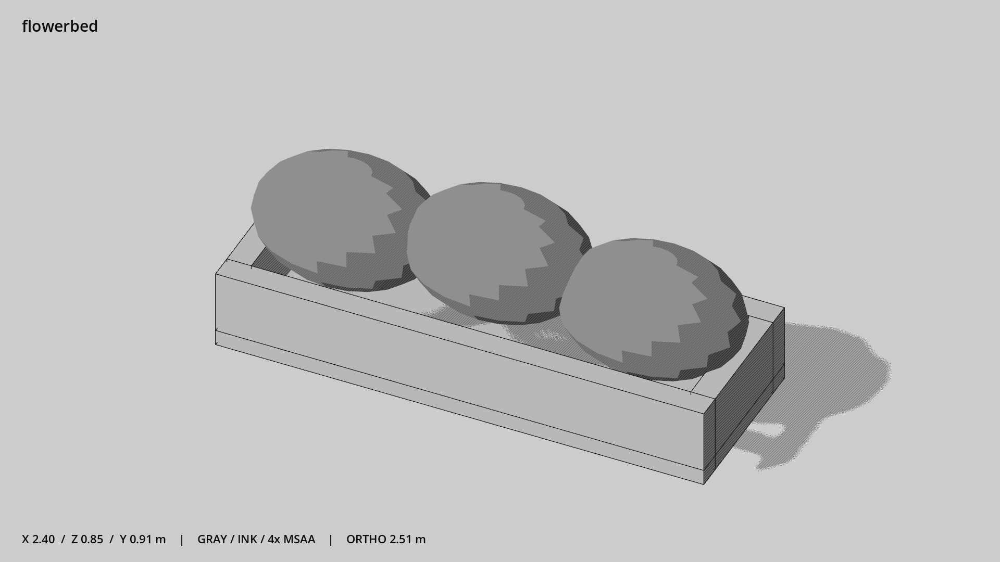

# 长条花坛 · `flowerbed`



- 模型：[GLB](../../../../models/flowerbed.glb)
- 重建脚本：[build_flowerbed.py](../../../build_flowerbed.py)；尺寸在开头 `P` 中。
- 依赖：[model_geometry.py](../../../model_geometry.py)
- 实测尺寸：X 宽 **2.4** × Z 深 **0.85** × Y 高 **0.91** 米。
- 色槽：`concrete`, `foliage`。
- 原点：底部接触平面中心；立面和屋顶配件由场景另给安装高度。 +Y 向上，正面/车头/使用面朝 +Z。
- 几何：1380 三角面，8 个封闭零件或规范允许的贴花片。
- 设计：花坛边高 0.4 米，内部三团实心植物。
- 交互参考：无预埋交互节点；由类型库以后标注。
- 来源：本项目原创脚本基本体建模；未使用第三方模型、纹理或生成服务。
- 检查：PASS；0 WARN。无警告。
- 复现：完整重跑后 GLB SHA-256 逐字节相同。

完整检查输出（同时保存为 [flowerbed.txt](flowerbed.txt)）：

```text
== C:\Users\Hsinlung\Desktop\news-game\godot\models\flowerbed.glb
   size  x 2.400  y 0.910  z 0.850 m
   box   min (-1.200, 0.000, -0.425)  max (1.200, 0.910, 0.425)
   triangles 1380: concrete 60, foliage 1320
   PASS
   EXTRA: outward volume and normal/winding consistency PASS
   SHA256 9401a526fa971559513d10cea56ea9e654475f4dfe33f19e19b73a138099cfef
   REBUILD IDENTICAL
```
