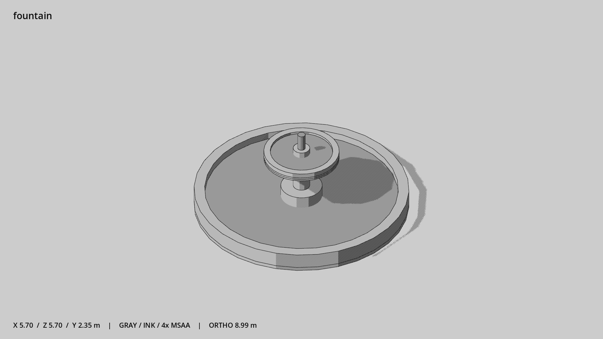

# 公园喷泉 · `fountain`



- 模型：[GLB](../../../../models/fountain.glb)
- 重建脚本：[build_fountain.py](../../../build_fountain.py)；尺寸在开头 `P` 中。
- 依赖：[model_geometry.py](../../../model_geometry.py)
- 实测尺寸：X 宽 **5.7** × Z 深 **5.7** × Y 高 **2.35** 米。
- 色槽：`concrete`, `metal`, `water`。
- 原点：底部接触平面中心；立面和屋顶配件由场景另给安装高度。 +Y 向上，正面/车头/使用面朝 +Z。
- 几何：1380 三角面，9 个封闭零件或规范允许的贴花片。
- 设计：直径 5.7 米；低圆池、中央喷水台、两处 water 实心水面；水流动画留给后续功能。
- 交互参考：无预埋交互节点；由类型库以后标注。
- 来源：本项目原创脚本基本体建模；未使用第三方模型、纹理或生成服务。
- 检查：PASS；0 WARN。无警告。
- 复现：完整重跑后 GLB SHA-256 逐字节相同。

完整检查输出（同时保存为 [fountain.txt](fountain.txt)）：

```text
== C:\Users\Hsinlung\Desktop\news-game\godot\models\fountain.glb
   size  x 5.700  y 2.350  z 5.700 m
   box   min (-2.850, 0.000, -2.850)  max (2.850, 2.350, 2.850)
   triangles 1380: concrete 1008, metal 124, water 248
   PASS
   EXTRA: outward volume and normal/winding consistency PASS
   SHA256 9af4d0ef66b94345aabe90873102ba7218075d165c85563142e8a29d946e751b
   REBUILD IDENTICAL
```
