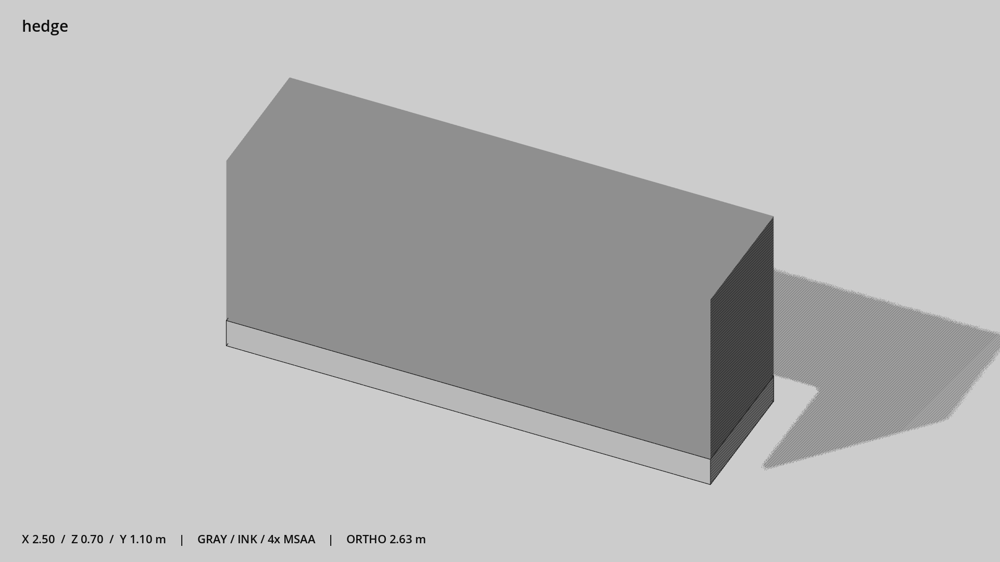

# 绿篱直段 · `hedge`



- 模型：[GLB](../../../../models/hedge.glb)
- 重建脚本：[build_hedge.py](../../../build_hedge.py)；尺寸在开头 `P` 中。
- 依赖：[model_geometry.py](../../../model_geometry.py)
- 实测尺寸：X 宽 **2.5** × Z 深 **0.7** × Y 高 **1.1** 米。
- 色槽：`concrete`, `foliage`。
- 原点：底部接触平面中心；立面和屋顶配件由场景另给安装高度。 +Y 向上，正面/车头/使用面朝 +Z。
- 几何：24 三角面，2 个封闭零件或规范允许的贴花片。
- 设计：2.5 米直段，可沿边界平移拼接，入口由场景留空。
- 交互参考：无预埋交互节点；由类型库以后标注。
- 来源：本项目原创脚本基本体建模；未使用第三方模型、纹理或生成服务。
- 检查：PASS；0 WARN。无警告。
- 复现：完整重跑后 GLB SHA-256 逐字节相同。

完整检查输出（同时保存为 [hedge.txt](hedge.txt)）：

```text
== C:\Users\Hsinlung\Desktop\news-game\godot\models\hedge.glb
   size  x 2.500  y 1.100  z 0.700 m
   box   min (-1.250, 0.000, -0.350)  max (1.250, 1.100, 0.350)
   triangles 24: concrete 12, foliage 12
   PASS
   EXTRA: outward volume and normal/winding consistency PASS
   SHA256 088e804a354b5c5f6388f9f37c1c86f72195a7a9f84b73cc186fcfefa47caba2
   REBUILD IDENTICAL
```
