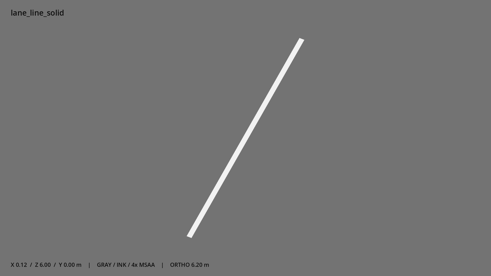

# 实线段 · `lane_line_solid`



- 模型：[GLB](../../../../models/lane_line_solid.glb)
- 重建脚本：[build_lane_line_solid.py](../../../build_lane_line_solid.py)；尺寸在开头 `P` 中。
- 依赖：[model_geometry.py](../../../model_geometry.py)
- 实测尺寸：X 宽 **0.12** × Z 深 **6** × Y 高 **0** 米。
- 色槽：`paint`。
- 原点：底部接触平面中心；立面和屋顶配件由场景另给安装高度。 +Y 向上，正面/车头/使用面朝 +Z。
- 几何：2 三角面，1 个封闭零件或规范允许的贴花片。
- 设计：贴地单面 paint 几何，离地 3 mm；规范允许的无投影开放薄片。
- 交互参考：无预埋交互节点；由类型库以后标注。
- 来源：本项目原创脚本基本体建模；未使用第三方模型、纹理或生成服务。
- 检查：PASS；0 WARN。无警告。
- 复现：完整重跑后 GLB SHA-256 逐字节相同。

完整检查输出（同时保存为 [lane_line_solid.txt](lane_line_solid.txt)）：

```text
== C:\Users\Hsinlung\Desktop\news-game\godot\models\lane_line_solid.glb
   size  x 0.120  y 0.000  z 6.000 m
   box   min (-0.060, 0.003, -3.000)  max (0.060, 0.003, 3.000)
   triangles 2: paint 2
   PASS
   EXTRA: outward volume and normal/winding consistency PASS
   SHA256 1a9c479d6498a84c54a8d7c120a8a696c60683ca56da56ea15fd21cee9715184
   REBUILD IDENTICAL
```
