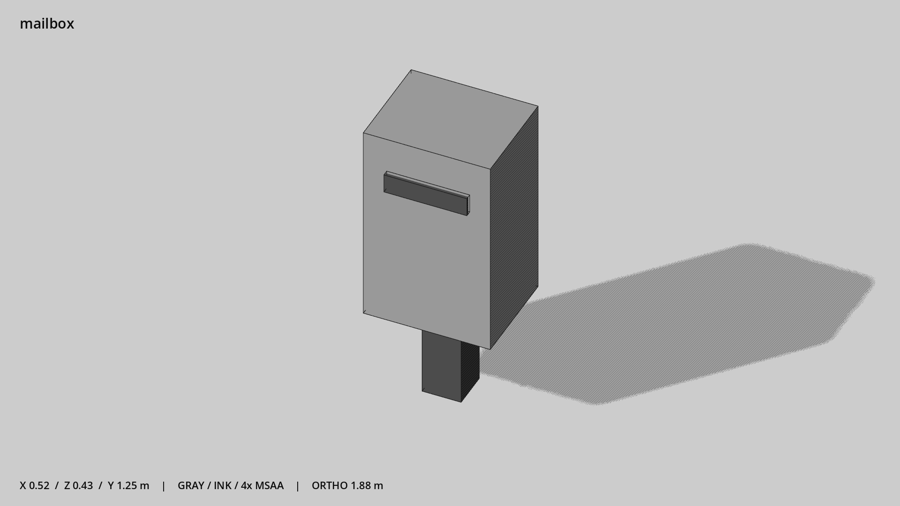

# 邮筒 · `mailbox`



- 模型：[GLB](../../../../models/mailbox.glb)
- 重建脚本：[build_mailbox.py](../../../build_mailbox.py)；尺寸在开头 `P` 中。
- 依赖：[model_geometry.py](../../../model_geometry.py)
- 实测尺寸：X 宽 **0.52** × Z 深 **0.432** × Y 高 **1.25** 米。
- 色槽：`metal`, `metal_dark`。
- 原点：底部接触平面中心；立面和屋顶配件由场景另给安装高度。 +Y 向上，正面/车头/使用面朝 +Z。
- 几何：36 三角面，3 个封闭零件或规范允许的贴花片。
- 设计：简化的封闭块体，无纹理。
- 交互参考：无预埋交互节点；由类型库以后标注。
- 来源：本项目原创脚本基本体建模；未使用第三方模型、纹理或生成服务。
- 检查：PASS；0 WARN。无警告。
- 复现：完整重跑后 GLB SHA-256 逐字节相同。

完整检查输出（同时保存为 [mailbox.txt](mailbox.txt)）：

```text
== C:\Users\Hsinlung\Desktop\news-game\godot\models\mailbox.glb
   size  x 0.520  y 1.250  z 0.432 m
   box   min (-0.260, 0.000, -0.210)  max (0.260, 1.250, 0.222)
   triangles 36: metal 12, metal_dark 24
   PASS
   EXTRA: outward volume and normal/winding consistency PASS
   SHA256 af2eaf2de3106cf309c2b8cfa5e9216ea4ceffdefbbf5cb65bb88138fbd99f4e
   REBUILD IDENTICAL
```
