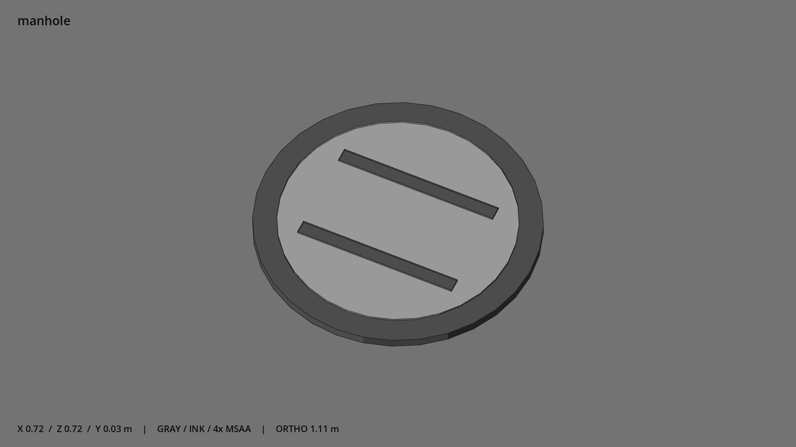

# 井盖 · `manhole`



- 模型：[GLB](../../../../models/manhole.glb)
- 重建脚本：[build_manhole.py](../../../build_manhole.py)；尺寸在开头 `P` 中。
- 依赖：[model_geometry.py](../../../model_geometry.py)
- 实测尺寸：X 宽 **0.72** × Z 深 **0.72** × Y 高 **0.032** 米。
- 色槽：`metal`, `metal_dark`。
- 原点：底部接触平面中心；立面和屋顶配件由场景另给安装高度。 +Y 向上，正面/车头/使用面朝 +Z。
- 几何：272 三角面，4 个封闭零件或规范允许的贴花片。
- 设计：圆井盖、两条宽握槽示意；封闭低实体。
- 交互参考：无预埋交互节点；由类型库以后标注。
- 来源：本项目原创脚本基本体建模；未使用第三方模型、纹理或生成服务。
- 检查：PASS；0 WARN。无警告。
- 复现：完整重跑后 GLB SHA-256 逐字节相同。

完整检查输出（同时保存为 [manhole.txt](manhole.txt)）：

```text
== C:\Users\Hsinlung\Desktop\news-game\godot\models\manhole.glb
   size  x 0.720  y 0.032  z 0.720 m
   box   min (-0.360, 0.000, -0.360)  max (0.360, 0.032, 0.360)
   triangles 272: metal 124, metal_dark 148
   PASS
   EXTRA: outward volume and normal/winding consistency PASS
   SHA256 f788ef4b2b5a7957beae6a6a70e418f0cc5019bc59ed53d7d872b36b899a85ac
   REBUILD IDENTICAL
```
