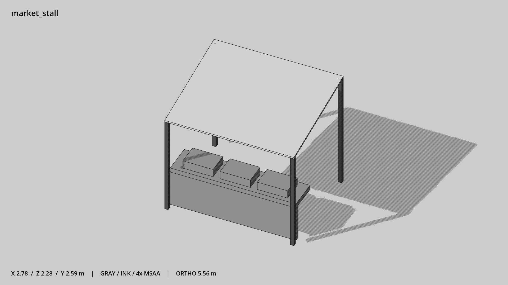

# 摊位 · `market_stall`



- 模型：[GLB](../../../../models/market_stall.glb)
- 重建脚本：[build_market_stall.py](../../../build_market_stall.py)；尺寸在开头 `P` 中。
- 依赖：[model_geometry.py](../../../model_geometry.py)
- 实测尺寸：X 宽 **2.775** × Z 深 **2.275** × Y 高 **2.585** 米。
- 色槽：`fabric`, `metal_dark`, `wood`。
- 原点：底部接触平面中心；立面和屋顶配件由场景另给安装高度。 +Y 向上，正面/车头/使用面朝 +Z。
- 几何：120 三角面，10 个封闭零件或规范允许的贴花片。
- 设计：柜台前置，后方净深约 1.4 米；开放后侧，货品以三块货箱示意。
- 交互参考：柜台顶 y=0.9；摊主 (0,0,-0.35)，顾客 (0,0,1.6)。
- 来源：本项目原创脚本基本体建模；未使用第三方模型、纹理或生成服务。
- 检查：PASS；0 WARN。无警告。
- 复现：完整重跑后 GLB SHA-256 逐字节相同。

完整检查输出（同时保存为 [market_stall.txt](market_stall.txt)）：

```text
== C:\Users\Hsinlung\Desktop\news-game\godot\models\market_stall.glb
   size  x 2.775  y 2.585  z 2.275 m
   box   min (-1.388, 0.000, -1.138)  max (1.388, 2.585, 1.138)
   triangles 120: fabric 12, metal_dark 48, wood 60
   PASS
   EXTRA: outward volume and normal/winding consistency PASS
   SHA256 caab7af444531553af000ab502fd475dd15892c277d4a2300f7288e1137062ee
   REBUILD IDENTICAL
```
