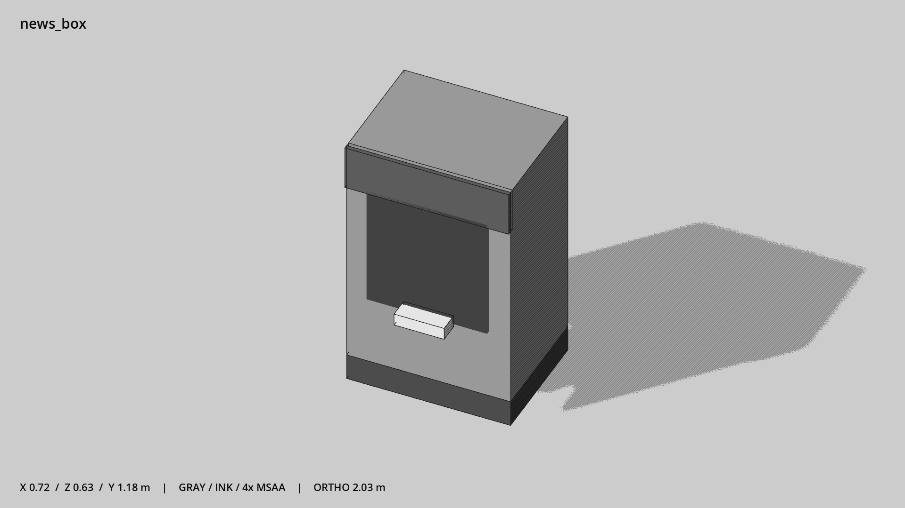

# 报纸箱 · `news_box`



- 模型：[GLB](../../../../models/news_box.glb)
- 重建脚本：[build_news_box.py](../../../build_news_box.py)；尺寸在开头 `P` 中。
- 依赖：[model_geometry.py](../../../model_geometry.py)
- 实测尺寸：X 宽 **0.72** × Z 深 **0.63** × Y 高 **1.18** 米。
- 色槽：`accent`, `metal`, `metal_dark`, `trim_dark`, `window`。
- 原点：底部接触平面中心；立面和屋顶配件由场景另给安装高度。 +Y 向上，正面/车头/使用面朝 +Z。
- 几何：60 三角面，5 个封闭零件或规范允许的贴花片。
- 设计：显眼的箱形轮廓、头牌与展示窗；不写字、不烘焙假报纸纹理。
- 交互参考：取报正面站位 (0,0,0.8)。
- 来源：本项目原创脚本基本体建模；未使用第三方模型、纹理或生成服务。
- 检查：PASS；0 WARN。无警告。
- 复现：完整重跑后 GLB SHA-256 逐字节相同。

完整检查输出（同时保存为 [news_box.txt](news_box.txt)）：

```text
== C:\Users\Hsinlung\Desktop\news-game\godot\models\news_box.glb
   size  x 0.720  y 1.180  z 0.630 m
   box   min (-0.360, 0.000, -0.270)  max (0.360, 1.180, 0.360)
   triangles 60: accent 12, metal 12, metal_dark 12, trim_dark 12, window 12
   PASS
   EXTRA: outward volume and normal/winding consistency PASS
   SHA256 aeee550a2d2f525ff11215a12d2d2248c6575d71aeab8dc82aee18f76c37dd6a
   REBUILD IDENTICAL
```
