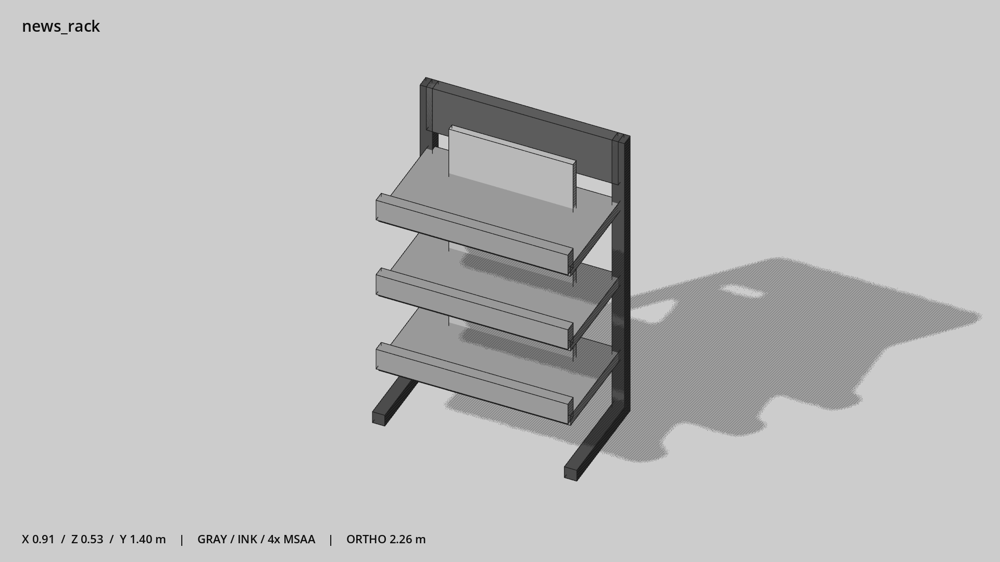

# 开放报刊架 · `news_rack`



- 模型：[GLB](../../../../models/news_rack.glb)
- 重建脚本：[build_news_rack.py](../../../build_news_rack.py)；尺寸在开头 `P` 中。
- 依赖：[model_geometry.py](../../../model_geometry.py)
- 实测尺寸：X 宽 **0.905** × Z 深 **0.532** × Y 高 **1.4** 米。
- 色槽：`concrete`, `metal`, `metal_dark`, `trim_dark`。
- 原点：底部接触平面中心；立面和屋顶配件由场景另给安装高度。 +Y 向上，正面/车头/使用面朝 +Z。
- 几何：168 三角面，14 个封闭零件或规范允许的贴花片。
- 设计：三层托盘配整块报纸示意，无密集纸张边线。
- 交互参考：无预埋交互节点；由类型库以后标注。
- 来源：本项目原创脚本基本体建模；未使用第三方模型、纹理或生成服务。
- 检查：PASS；0 WARN。无警告。
- 复现：完整重跑后 GLB SHA-256 逐字节相同。

完整检查输出（同时保存为 [news_rack.txt](news_rack.txt)）：

```text
== C:\Users\Hsinlung\Desktop\news-game\godot\models\news_rack.glb
   size  x 0.905  y 1.400  z 0.532 m
   box   min (-0.453, 0.000, -0.267)  max (0.453, 1.400, 0.265)
   triangles 168: concrete 36, metal 72, metal_dark 48, trim_dark 12
   PASS
   EXTRA: outward volume and normal/winding consistency PASS
   SHA256 43e5b87e7e4861a3dd129831280e6324972f035d0b86a8b1f81f8662acd8dd03
   REBUILD IDENTICAL
```
