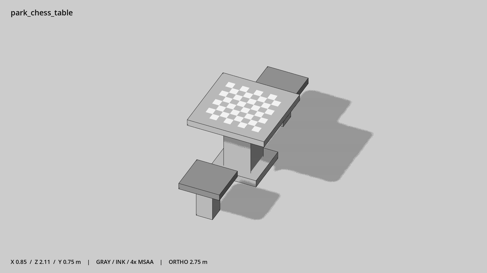

# 棋桌与双凳 · `park_chess_table`



- 模型：[GLB](../../../../models/park_chess_table.glb)
- 重建脚本：[build_park_chess_table.py](../../../build_park_chess_table.py)；尺寸在开头 `P` 中。
- 依赖：[model_geometry.py](../../../model_geometry.py)
- 实测尺寸：X 宽 **0.85** × Z 深 **2.11** × Y 高 **0.752** 米。
- 色槽：`concrete`, `paint`, `wood`。
- 原点：底部接触平面中心；立面和屋顶配件由场景另给安装高度。 +Y 向上，正面/车头/使用面朝 +Z。
- 几何：468 三角面，39 个封闭零件或规范允许的贴花片。
- 设计：两凳沿 Z 相对；棋盘格为浅薄实体，无棋子。
- 交互参考：桌面 y=0.75；凳面中心 (0,0.45,±0.84)，面向桌心。
- 来源：本项目原创脚本基本体建模；未使用第三方模型、纹理或生成服务。
- 检查：PASS；0 WARN。无警告。
- 复现：完整重跑后 GLB SHA-256 逐字节相同。

完整检查输出（同时保存为 [park_chess_table.txt](park_chess_table.txt)）：

```text
== C:\Users\Hsinlung\Desktop\news-game\godot\models\park_chess_table.glb
   size  x 0.850  y 0.752  z 2.110 m
   box   min (-0.425, 0.000, -1.055)  max (0.425, 0.752, 1.055)
   triangles 468: concrete 60, paint 384, wood 24
   PASS
   EXTRA: outward volume and normal/winding consistency PASS
   SHA256 c9b3b27f2ec0234095271689fdceb7191a68f298a072a16a14da815834dc1280
   REBUILD IDENTICAL
```
