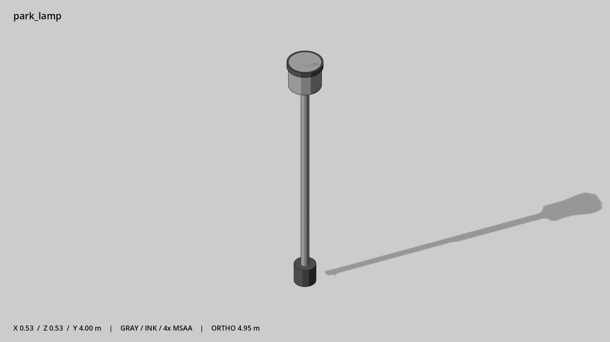

# 公园柱灯 · `park_lamp`



- 模型：[GLB](../../../../models/park_lamp.glb)
- 重建脚本：[build_park_lamp.py](../../../build_park_lamp.py)；尺寸在开头 `P` 中。
- 依赖：[model_geometry.py](../../../model_geometry.py)
- 实测尺寸：X 宽 **0.528** × Z 深 **0.528** × Y 高 **4** 米。
- 色槽：`metal`, `metal_dark`。
- 原点：杆底中心。 +Y 向上，正面/车头/使用面朝 +Z。
- 几何：496 三角面，4 个封闭零件或规范允许的贴花片。
- 设计：4 米无横臂柱灯，与街灯轮廓不同。
- 交互参考：无预埋交互节点；由类型库以后标注。
- 来源：本项目原创脚本基本体建模；未使用第三方模型、纹理或生成服务。
- 检查：PASS；0 WARN。无警告。
- 复现：完整重跑后 GLB SHA-256 逐字节相同。

完整检查输出（同时保存为 [park_lamp.txt](park_lamp.txt)）：

```text
== C:\Users\Hsinlung\Desktop\news-game\godot\models\park_lamp.glb
   size  x 0.528  y 4.000  z 0.528 m
   box   min (-0.264, 0.000, -0.264)  max (0.264, 4.000, 0.264)
   triangles 496: metal 248, metal_dark 248
   PASS
   EXTRA: outward volume and normal/winding consistency PASS
   SHA256 c530bb20736dbcba183475c083322b3ddb976c6465a141a903157d63e7006c8e
   REBUILD IDENTICAL
```
