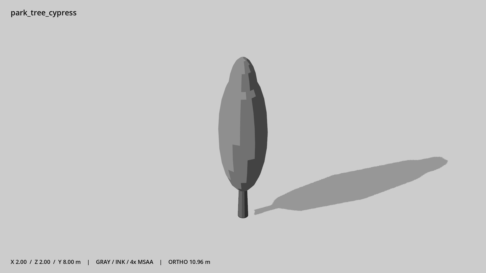

# 细高柏树 · `park_tree_cypress`



- 模型：[GLB](../../../../models/park_tree_cypress.glb)
- 重建脚本：[build_park_tree_cypress.py](../../../build_park_tree_cypress.py)；尺寸在开头 `P` 中。
- 依赖：[model_geometry.py](../../../model_geometry.py)
- 实测尺寸：X 宽 **2** × Z 深 **2** × Y 高 **8** 米。
- 色槽：`bark`, `foliage`。
- 原点：底部接触平面中心；立面和屋顶配件由场景另给安装高度。 +Y 向上，正面/车头/使用面朝 +Z。
- 几何：1252 三角面，5 个封闭零件或规范允许的贴花片。
- 设计：树冠为封闭团块；无叶片、贴图或随机几何。
- 交互参考：无预埋交互节点；由类型库以后标注。
- 来源：本项目原创脚本基本体建模；未使用第三方模型、纹理或生成服务。
- 检查：PASS；0 WARN。无警告。
- 复现：完整重跑后 GLB SHA-256 逐字节相同。

完整检查输出（同时保存为 [park_tree_cypress.txt](park_tree_cypress.txt)）：

```text
== C:\Users\Hsinlung\Desktop\news-game\godot\models\park_tree_cypress.glb
   size  x 2.000  y 8.000  z 2.000 m
   box   min (-1.000, 0.000, -1.000)  max (1.000, 8.000, 1.000)
   triangles 1252: bark 372, foliage 880
   PASS
   EXTRA: outward volume and normal/winding consistency PASS
   SHA256 85cfcedfbb4832f6f092c6c7d8d63b9c3d77d1a0d96d193555a9b5c7e1fc58fe
   REBUILD IDENTICAL
```
