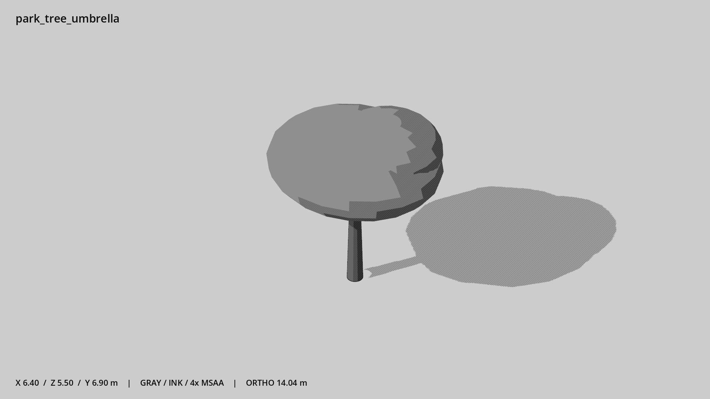

# 伞冠公园树 · `park_tree_umbrella`



- 模型：[GLB](../../../../models/park_tree_umbrella.glb)
- 重建脚本：[build_park_tree_umbrella.py](../../../build_park_tree_umbrella.py)；尺寸在开头 `P` 中。
- 依赖：[model_geometry.py](../../../model_geometry.py)
- 实测尺寸：X 宽 **6.4** × Z 深 **5.5** × Y 高 **6.9** 米。
- 色槽：`bark`, `foliage`。
- 原点：底部接触平面中心；立面和屋顶配件由场景另给安装高度。 +Y 向上，正面/车头/使用面朝 +Z。
- 几何：1252 三角面，5 个封闭零件或规范允许的贴花片。
- 设计：树冠为封闭团块；无叶片、贴图或随机几何。
- 交互参考：无预埋交互节点；由类型库以后标注。
- 来源：本项目原创脚本基本体建模；未使用第三方模型、纹理或生成服务。
- 检查：PASS；0 WARN。无警告。
- 复现：完整重跑后 GLB SHA-256 逐字节相同。

完整检查输出（同时保存为 [park_tree_umbrella.txt](park_tree_umbrella.txt)）：

```text
== C:\Users\Hsinlung\Desktop\news-game\godot\models\park_tree_umbrella.glb
   size  x 6.400  y 6.900  z 5.500 m
   box   min (-3.200, 0.000, -2.750)  max (3.200, 6.900, 2.750)
   triangles 1252: bark 372, foliage 880
   PASS
   EXTRA: outward volume and normal/winding consistency PASS
   SHA256 aed8ebdd0461e552b57770c339ce229c7f74d7364deb556b1edbe22709c68e16
   REBUILD IDENTICAL
```
