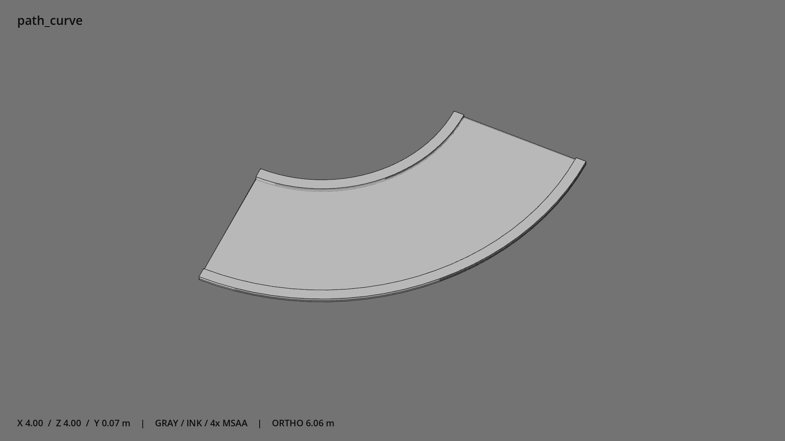

# 小径四分之一弯段 · `path_curve`



- 模型：[GLB](../../../../models/path_curve.glb)
- 重建脚本：[build_path_curve.py](../../../build_path_curve.py)；尺寸在开头 `P` 中。
- 依赖：[model_geometry.py](../../../model_geometry.py)
- 实测尺寸：X 宽 **4** × Z 深 **4** × Y 高 **0.07** 米。
- 色槽：`concrete`。
- 原点：弧段中心线中点的地面投影，详见下方拼接坐标。 +Y 向上，正面/车头/使用面朝 +Z。
- 几何：588 三角面，3 个封闭零件或规范允许的贴花片。
- 设计：宽 2 米，中心线半径 3 米，90°弯段；原点在弧段中点的地面投影。
- 交互参考：圆心 (-2.1213,0,-2.1213)，端点 (0.8787,0,-2.1213)、(-2.1213,0,0.8787)；可旋转拼接。
- 来源：本项目原创脚本基本体建模；未使用第三方模型、纹理或生成服务。
- 检查：PASS；0 WARN。无警告。
- 复现：完整重跑后 GLB SHA-256 逐字节相同。

完整检查输出（同时保存为 [path_curve.txt](path_curve.txt)）：

```text
== C:\Users\Hsinlung\Desktop\news-game\godot\models\path_curve.glb
   size  x 4.000  y 0.070  z 4.000 m
   box   min (-2.121, 0.000, -2.121)  max (1.879, 0.070, 1.879)
   triangles 588: concrete 588
   PASS
   EXTRA: outward volume and normal/winding consistency PASS
   SHA256 4a411602ad0f5024cc092d382fff1b9a77783c585029de959127c86eec99012e
   REBUILD IDENTICAL
```
