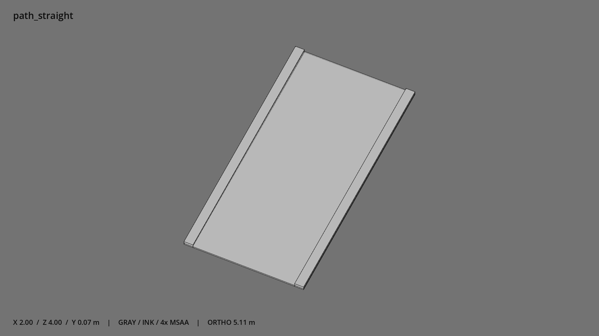

# 小径直段 · `path_straight`



- 模型：[GLB](../../../../models/path_straight.glb)
- 重建脚本：[build_path_straight.py](../../../build_path_straight.py)；尺寸在开头 `P` 中。
- 依赖：[model_geometry.py](../../../model_geometry.py)
- 实测尺寸：X 宽 **2** × Z 深 **4** × Y 高 **0.07** 米。
- 色槽：`concrete`。
- 原点：底部接触平面中心；立面和屋顶配件由场景另给安装高度。 +Y 向上，正面/车头/使用面朝 +Z。
- 几何：36 三角面，3 个封闭零件或规范允许的贴花片。
- 设计：宽 2 米，长 4 米；两侧路缘石，端部留通行口。
- 交互参考：拼接端 (0,0,±2)。
- 来源：本项目原创脚本基本体建模；未使用第三方模型、纹理或生成服务。
- 检查：PASS；0 WARN。无警告。
- 复现：完整重跑后 GLB SHA-256 逐字节相同。

完整检查输出（同时保存为 [path_straight.txt](path_straight.txt)）：

```text
== C:\Users\Hsinlung\Desktop\news-game\godot\models\path_straight.glb
   size  x 2.000  y 0.070  z 4.000 m
   box   min (-1.000, 0.000, -2.000)  max (1.000, 0.070, 2.000)
   triangles 36: concrete 36
   PASS
   EXTRA: outward volume and normal/winding consistency PASS
   SHA256 565e76c64985390663780cecab6945dbf5d39483b6b522bc9f7c92a635083d1a
   REBUILD IDENTICAL
```
