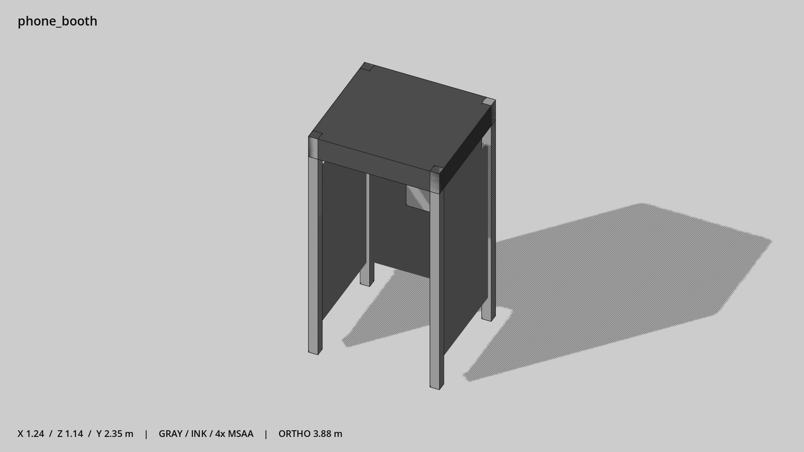

# 电话亭 · `phone_booth`



- 模型：[GLB](../../../../models/phone_booth.glb)
- 重建脚本：[build_phone_booth.py](../../../build_phone_booth.py)；尺寸在开头 `P` 中。
- 依赖：[model_geometry.py](../../../model_geometry.py)
- 实测尺寸：X 宽 **1.24** × Z 深 **1.14** × Y 高 **2.35** 米。
- 色槽：`metal`, `metal_dark`, `window`。
- 原点：底部接触平面中心；立面和屋顶配件由场景另给安装高度。 +Y 向上，正面/车头/使用面朝 +Z。
- 几何：108 三角面，9 个封闭零件或规范允许的贴花片。
- 设计：开放正面、两侧与背面为不透明窗板；可站入，不做半透明玻璃。
- 交互参考：站位 (0,0,0.15)，电话朝亭内 +Z。
- 来源：本项目原创脚本基本体建模；未使用第三方模型、纹理或生成服务。
- 检查：PASS；0 WARN。无警告。
- 复现：完整重跑后 GLB SHA-256 逐字节相同。

完整检查输出（同时保存为 [phone_booth.txt](phone_booth.txt)）：

```text
== C:\Users\Hsinlung\Desktop\news-game\godot\models\phone_booth.glb
   size  x 1.240  y 2.350  z 1.140 m
   box   min (-0.620, 0.000, -0.570)  max (0.620, 2.350, 0.570)
   triangles 108: metal 60, metal_dark 12, window 36
   PASS
   EXTRA: outward volume and normal/winding consistency PASS
   SHA256 2e809f335ba997b4a26e138a881b6e0c616ed47b5a9c3af98af43b59ac6d6868
   REBUILD IDENTICAL
```
