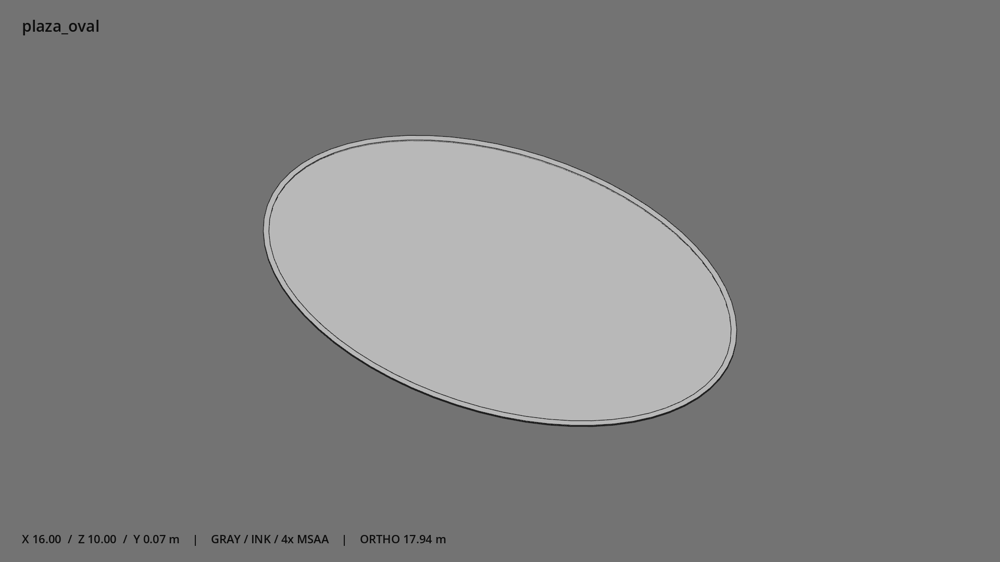

# 椭圆棋桌广场 · `plaza_oval`



- 模型：[GLB](../../../../models/plaza_oval.glb)
- 重建脚本：[build_plaza_oval.py](../../../build_plaza_oval.py)；尺寸在开头 `P` 中。
- 依赖：[model_geometry.py](../../../model_geometry.py)
- 实测尺寸：X 宽 **16** × Z 深 **10** × Y 高 **0.07** 米。
- 色槽：`concrete`。
- 原点：底部接触平面中心；立面和屋顶配件由场景另给安装高度。 +Y 向上，正面/车头/使用面朝 +Z。
- 几何：764 三角面，2 个封闭零件或规范允许的贴花片。
- 设计：铺装厚 2.5 厘米，外缘完整路缘石高 7 厘米；独立贴地块。
- 交互参考：无预埋交互节点；由类型库以后标注。
- 来源：本项目原创脚本基本体建模；未使用第三方模型、纹理或生成服务。
- 检查：PASS；0 WARN。无警告。
- 复现：完整重跑后 GLB SHA-256 逐字节相同。

完整检查输出（同时保存为 [plaza_oval.txt](plaza_oval.txt)）：

```text
== C:\Users\Hsinlung\Desktop\news-game\godot\models\plaza_oval.glb
   size  x 16.000  y 0.070  z 10.000 m
   box   min (-8.000, 0.000, -5.000)  max (8.000, 0.070, 5.000)
   triangles 764: concrete 764
   PASS
   EXTRA: outward volume and normal/winding consistency PASS
   SHA256 705fc22378c3601c30a25fb98b1bf40c71d15a25aab87cb58818a20371a6feb5
   REBUILD IDENTICAL
```
