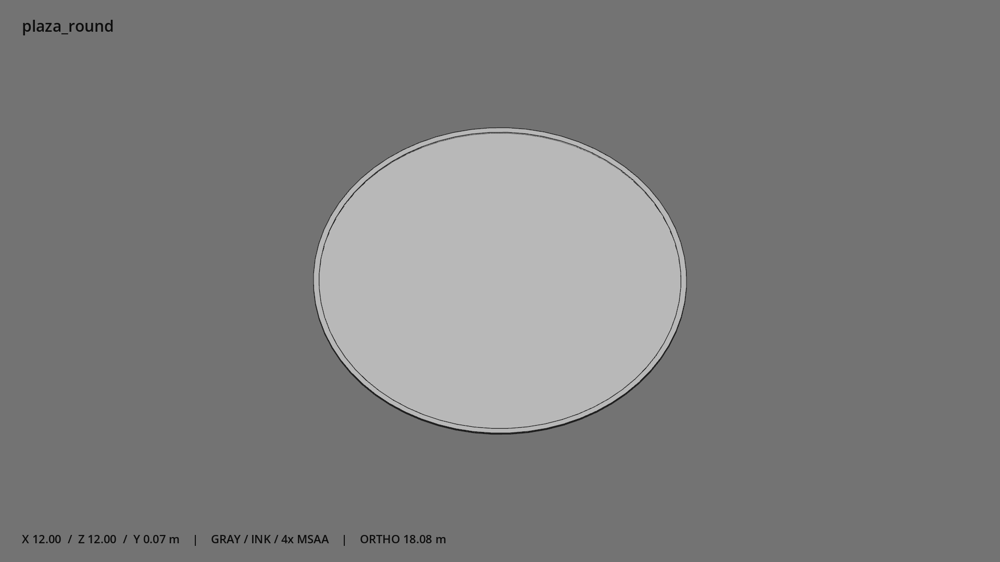

# 圆形喷泉广场 · `plaza_round`



- 模型：[GLB](../../../../models/plaza_round.glb)
- 重建脚本：[build_plaza_round.py](../../../build_plaza_round.py)；尺寸在开头 `P` 中。
- 依赖：[model_geometry.py](../../../model_geometry.py)
- 实测尺寸：X 宽 **12** × Z 深 **12** × Y 高 **0.07** 米。
- 色槽：`concrete`。
- 原点：底部接触平面中心；立面和屋顶配件由场景另给安装高度。 +Y 向上，正面/车头/使用面朝 +Z。
- 几何：764 三角面，2 个封闭零件或规范允许的贴花片。
- 设计：铺装厚 2.5 厘米，外缘完整路缘石高 7 厘米；独立贴地块。
- 交互参考：无预埋交互节点；由类型库以后标注。
- 来源：本项目原创脚本基本体建模；未使用第三方模型、纹理或生成服务。
- 检查：PASS；0 WARN。无警告。
- 复现：完整重跑后 GLB SHA-256 逐字节相同。

完整检查输出（同时保存为 [plaza_round.txt](plaza_round.txt)）：

```text
== C:\Users\Hsinlung\Desktop\news-game\godot\models\plaza_round.glb
   size  x 12.000  y 0.070  z 12.000 m
   box   min (-6.000, 0.000, -6.000)  max (6.000, 0.070, 6.000)
   triangles 764: concrete 764
   PASS
   EXTRA: outward volume and normal/winding consistency PASS
   SHA256 fac992448202d464ec0303c6f92c3bc1e108073da60d6fb1135d724c73990f02
   REBUILD IDENTICAL
```
