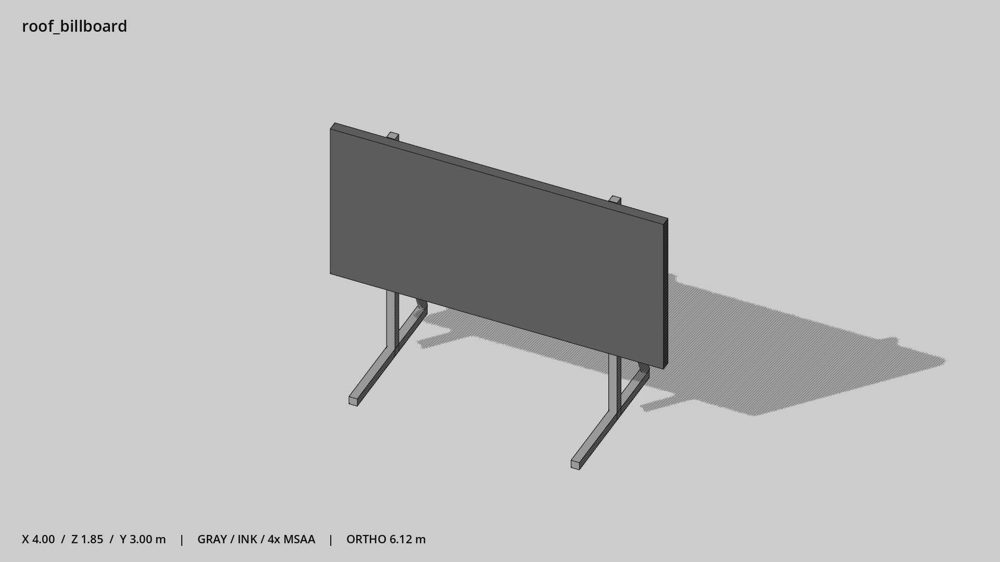

# 屋顶广告牌架 · `roof_billboard`



- 模型：[GLB](../../../../models/roof_billboard.glb)
- 重建脚本：[build_roof_billboard.py](../../../build_roof_billboard.py)；尺寸在开头 `P` 中。
- 依赖：[model_geometry.py](../../../model_geometry.py)
- 实测尺寸：X 宽 **4** × Z 深 **1.846** × Y 高 **3** 米。
- 色槽：`metal`, `trim_dark`。
- 原点：底部接触平面中心；立面和屋顶配件由场景另给安装高度。 +Y 向上，正面/车头/使用面朝 +Z。
- 几何：308 三角面，7 个封闭零件或规范允许的贴花片。
- 设计：招牌空白，背部斜撑；接触面是支架底。
- 交互参考：无预埋交互节点；由类型库以后标注。
- 来源：本项目原创脚本基本体建模；未使用第三方模型、纹理或生成服务。
- 检查：PASS；0 WARN。无警告。
- 复现：完整重跑后 GLB SHA-256 逐字节相同。

完整检查输出（同时保存为 [roof_billboard.txt](roof_billboard.txt)）：

```text
== C:\Users\Hsinlung\Desktop\news-game\godot\models\roof_billboard.glb
   size  x 4.000  y 3.000  z 1.846 m
   box   min (-2.000, 0.000, -0.946)  max (2.000, 3.000, 0.900)
   triangles 308: metal 296, trim_dark 12
   PASS
   EXTRA: outward volume and normal/winding consistency PASS
   SHA256 b25b2e71e769f5fa336147b84cdd39a78e95c3533a34b0710add47b3a18d4e4a
   REBUILD IDENTICAL
```
