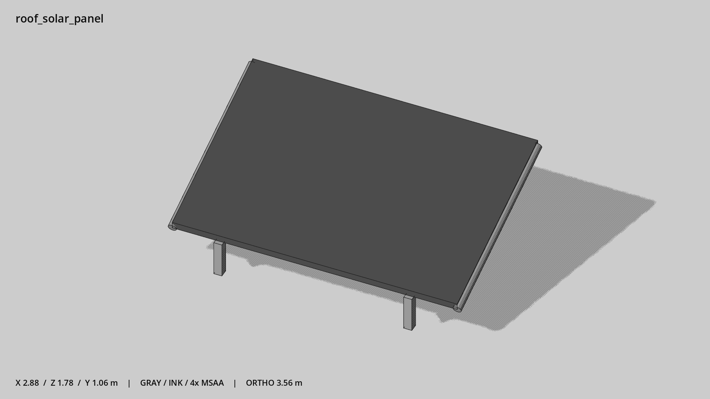

# 屋顶太阳能板 · `roof_solar_panel`



- 模型：[GLB](../../../../models/roof_solar_panel.glb)
- 重建脚本：[build_roof_solar_panel.py](../../../build_roof_solar_panel.py)；尺寸在开头 `P` 中。
- 依赖：[model_geometry.py](../../../model_geometry.py)
- 实测尺寸：X 宽 **2.88** × Z 深 **1.78** × Y 高 **1.06** 米。
- 色槽：`metal`, `metal_dark`。
- 原点：底部接触平面中心；立面和屋顶配件由场景另给安装高度。 +Y 向上，正面/车头/使用面朝 +Z。
- 几何：308 三角面，7 个封闭零件或规范允许的贴花片。
- 设计：单块暗色斜板，几何边框；没有纹理电池格。
- 交互参考：无预埋交互节点；由类型库以后标注。
- 来源：本项目原创脚本基本体建模；未使用第三方模型、纹理或生成服务。
- 检查：PASS；0 WARN。无警告。
- 复现：完整重跑后 GLB SHA-256 逐字节相同。

完整检查输出（同时保存为 [roof_solar_panel.txt](roof_solar_panel.txt)）：

```text
== C:\Users\Hsinlung\Desktop\news-game\godot\models\roof_solar_panel.glb
   size  x 2.880  y 1.060  z 1.780 m
   box   min (-1.440, 0.000, -0.890)  max (1.440, 1.060, 0.890)
   triangles 308: metal 296, metal_dark 12
   PASS
   EXTRA: outward volume and normal/winding consistency PASS
   SHA256 adc4c4dd82246f9901c5bc598c8c32eac0bc766dd6691859656f9f0a0ad882c8
   REBUILD IDENTICAL
```
