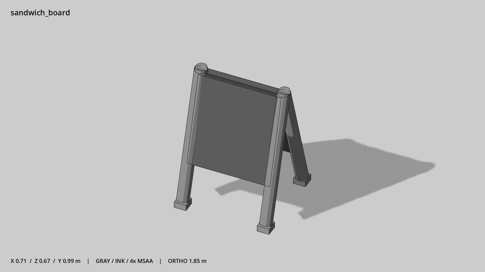

# 店门口立牌 · `sandwich_board`



- 模型：[GLB](../../../../models/sandwich_board.glb)
- 重建脚本：[build_sandwich_board.py](../../../build_sandwich_board.py)；尺寸在开头 `P` 中。
- 依赖：[model_geometry.py](../../../model_geometry.py)
- 实测尺寸：X 宽 **0.71** × Z 深 **0.67** × Y 高 **0.988** 米。
- 色槽：`trim_dark`, `wood`。
- 原点：底部接触平面中心；立面和屋顶配件由场景另给安装高度。 +Y 向上，正面/车头/使用面朝 +Z。
- 几何：568 三角面，10 个封闭零件或规范允许的贴花片。
- 设计：双面空白 A 字立牌。
- 交互参考：无预埋交互节点；由类型库以后标注。
- 来源：本项目原创脚本基本体建模；未使用第三方模型、纹理或生成服务。
- 检查：PASS；0 WARN。无警告。
- 复现：完整重跑后 GLB SHA-256 逐字节相同。

完整检查输出（同时保存为 [sandwich_board.txt](sandwich_board.txt)）：

```text
== C:\Users\Hsinlung\Desktop\news-game\godot\models\sandwich_board.glb
   size  x 0.710  y 0.988  z 0.670 m
   box   min (-0.355, 0.000, -0.335)  max (0.355, 0.988, 0.335)
   triangles 568: trim_dark 24, wood 544
   PASS
   EXTRA: outward volume and normal/winding consistency PASS
   SHA256 aed4a22252b355db4eac42d086a9479fb5f8d04c79620064e033373122cb31d7
   REBUILD IDENTICAL
```
