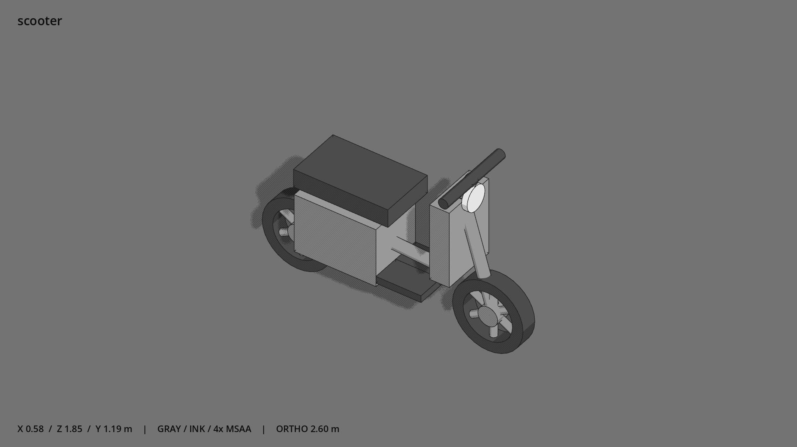

# 电动车 · `scooter`



- 模型：[GLB](../../../../models/scooter.glb)
- 重建脚本：[build_scooter.py](../../../build_scooter.py)；尺寸在开头 `P` 中。
- 依赖：[model_geometry.py](../../../model_geometry.py)、[vehicle_geometry.py](../../../vehicle_geometry.py)
- 实测尺寸：X 宽 **0.58** × Z 深 **1.85** × Y 高 **1.195** 米。
- 色槽：`accent`, `metal`, `metal_dark`。
- 原点：底部接触平面中心；立面和屋顶配件由场景另给安装高度。 +Y 向上，正面/车头/使用面朝 +Z。
- 几何：2432 三角面，22 个封闭零件或规范允许的贴花片。
- 设计：清单“摩托 / 电动车”选择电动车一款：踏板式，电池车体只在座下，座前是低踏板（左右两块 footrest）；前挡板和前灯。轮子是独立节点，可转动。
- 交互参考：骑乘接触点按节点名从模型读取（saddle / handlebar / footrest_left / footrest_right / wheel_front / wheel_rear）；长座上坐的位置由类型 types/scooter.tscn 的 seat 标记给出。
- 来源：本项目原创脚本基本体建模；未使用第三方模型、纹理或生成服务。
- 检查：PASS；0 WARN。无警告。
- 复现：完整重跑后 GLB SHA-256 逐字节相同。

完整检查输出（同时保存为 [scooter.txt](scooter.txt)）：

```text
== C:\Users\Hsinlung\Desktop\news-game\godot\models\scooter.glb
   size  x 0.580  y 1.195  z 1.850 m
   box   min (-0.290, 0.000, -0.925)  max (0.290, 1.195, 0.925)
   triangles 2432: accent 124, metal 1636, metal_dark 672
   PASS
   EXTRA: outward volume and normal/winding consistency PASS
   SHA256 ee9590bf7203cb9c46fdbf3e5c7daf28d16677b376cd4b7648edd9aab66e2064
   REBUILD IDENTICAL
```
