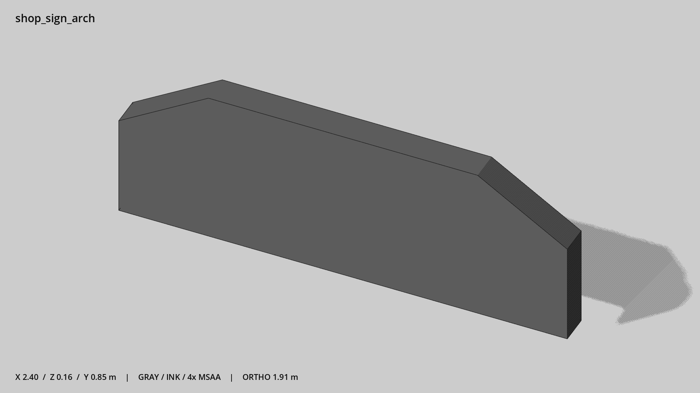

# 拱顶招牌 · `shop_sign_arch`



- 模型：[GLB](../../../../models/shop_sign_arch.glb)
- 重建脚本：[build_shop_sign_arch.py](../../../build_shop_sign_arch.py)；尺寸在开头 `P` 中。
- 依赖：[model_geometry.py](../../../model_geometry.py)
- 实测尺寸：X 宽 **2.4** × Z 深 **0.16** × Y 高 **0.85** 米。
- 色槽：`trim_dark`。
- 原点：底部接触平面中心；立面和屋顶配件由场景另给安装高度。 +Y 向上，正面/车头/使用面朝 +Z。
- 几何：20 三角面，1 个封闭零件或规范允许的贴花片。
- 设计：空白独立招牌；以底边中心为安装锚点，场景提供安装高度。
- 交互参考：无预埋交互节点；由类型库以后标注。
- 来源：本项目原创脚本基本体建模；未使用第三方模型、纹理或生成服务。
- 检查：PASS；0 WARN。无警告。
- 复现：完整重跑后 GLB SHA-256 逐字节相同。

完整检查输出（同时保存为 [shop_sign_arch.txt](shop_sign_arch.txt)）：

```text
== C:\Users\Hsinlung\Desktop\news-game\godot\models\shop_sign_arch.glb
   size  x 2.400  y 0.850  z 0.160 m
   box   min (-1.200, 0.000, -0.080)  max (1.200, 0.850, 0.080)
   triangles 20: trim_dark 20
   PASS
   EXTRA: outward volume and normal/winding consistency PASS
   SHA256 6a149bbed80a6f657f4e22157f5afcf5d27e289e68e8d08504032d7e3b07ab0c
   REBUILD IDENTICAL
```
